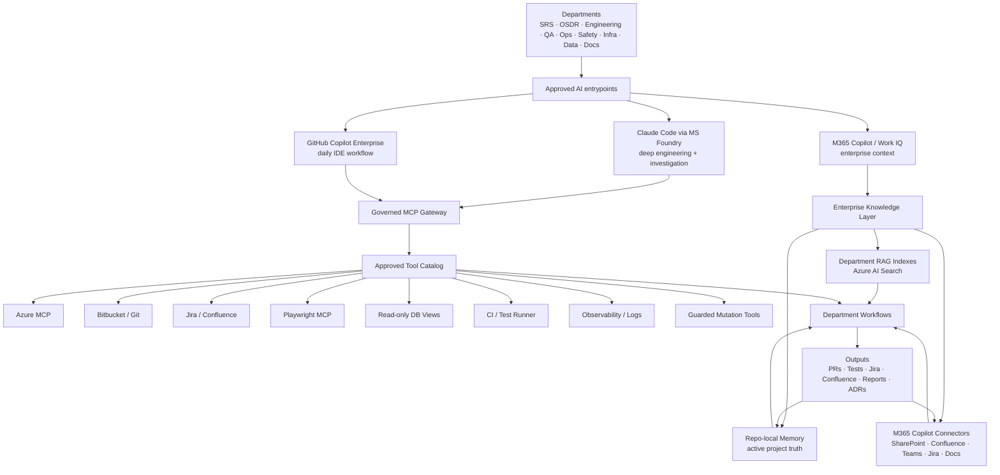
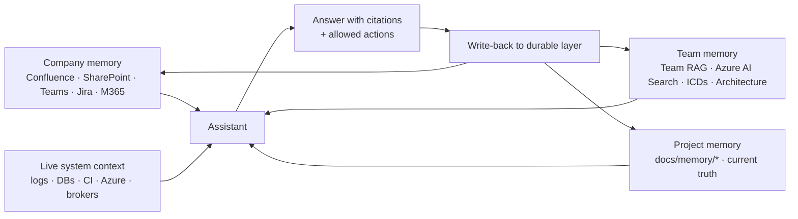
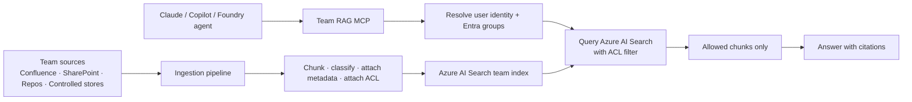
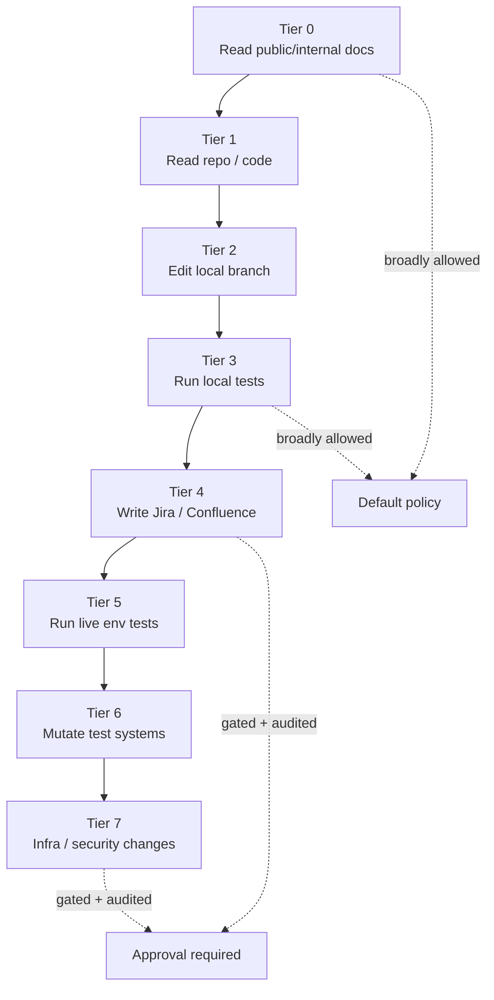
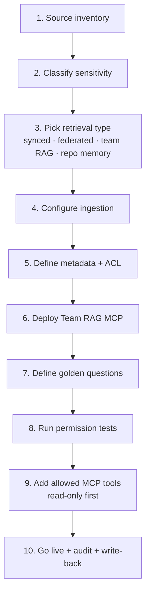

# 🧭 MUAC AI-Assisted Engineering Framework — Showcase

> **A reusable, governed platform pattern for AI-assisted engineering, QA, operations, safety, infrastructure, data, and documentation work across an organization.**
>
> *This repository is a proposal-grade boilerplate. Nothing here implies that any tool, vendor, or integration has been formally approved by MUAC — it is a structure teams can copy, adapt, and discuss.*

---

## The one-line message

> **Do not pick one chatbot. Build a secure AI-assisted engineering platform: approved assistants, governed MCP tools, enterprise/team RAG, project memory, and write-back discipline.**

---

## The 30-second pitch

| Layer | What it solves | Where it lives |
|---|---|---|
| 🤖 **Approved assistants** | Consistent, audited entry points | Claude Code via MS Foundry, GitHub Copilot Enterprise, Microsoft 365 Copilot |
| 🧠 **Enterprise knowledge** | Broad org docs, meetings, decisions | M365 Copilot connectors / Work IQ / Microsoft Graph |
| 🧬 **Team RAG** | Domain-deep, ACL-protected corpora | Azure AI Search index per team |
| 📁 **Project memory** | Active delivery truth | `docs/memory/*` inside each repo |
| 🔧 **Governed MCP catalog** | Live system access with tiers | Approved MCP servers (Azure, Atlassian, Playwright, read-only DB, …) |
| 🛡️ **Permissions & audit** | No data leakage, traceable actions | Entra ID groups, ACL filtering before retrieval, audit logs |

---

## Full enterprise architecture



---

## Memory hierarchy — the right knowledge in the right place



| Memory layer | Purpose | Storage | Reach |
|---|---|---|---|
| **Company memory** | Broad org docs, meetings, policies | M365 Graph / connector indexes | M365 Copilot, Work IQ |
| **Team memory** | ICDs, architecture, testability, domain knowledge | Azure AI Search team index | Team RAG MCP |
| **Project memory** | Coverage, blockers, decisions, selectors, route maps | Git markdown (`docs/memory/*`) | Direct file read by Claude/Copilot |
| **Live system context** | DB rows, logs, CI state, Azure status | Source systems (no copy) | Approved MCP tools, read-only first |

**Core rule:** *The more sensitive the document, the less it should be copied.*

---

## Team RAG flow



The model **never** receives chunks the user is not allowed to see — filtering happens before retrieval.

---

## Permission / security trimming

```mermaid
flowchart TD
    A[User asks question] --> B[Authenticate via Entra ID]
    B --> C[Resolve user groups]
    C --> D[Run search with ACL filter]
    D --> E{Document ACL matches user/groups?}
    E -->|Yes| F[Return chunk + citation]
    E -->|No| G[Drop chunk silently]
    F --> H[Assistant answers using allowed sources only]
    G --> I[If no allowed content remains: "no accessible result / restricted"]
```

| Sensitivity | Example | Recommended retrieval | AI access |
|---|---|---|---|
| **L0 General internal** | Coding standards, onboarding | Synced connector | Broad internal |
| **L1 Team internal** | Team design notes | Team RAG with group ACL | Team members |
| **L2 Restricted technical** | Interface specs, environment docs | Team RAG strict ACL or federated | Approved groups |
| **L3 Sensitive / security-risk** | Threat models, vuln details | Federated retrieval only, minimal summary | Case-by-case |
| **L4 Secret / regulated** | Credentials, classified ops | No default AI access | Approved secure process only |

---

## MCP tool governance



See [`docs/mcp-catalog.md`](docs/mcp-catalog.md) for the full tool list and policies.

---

## Team onboarding flow



Templates for steps 1–9 live in [`templates/team-onboarding/`](templates/team-onboarding/).

---

## What teams copy vs what the platform team provides

| Concern | Platform team provides centrally | Each team customizes |
|---|---|---|
| Approved AI assistants | ✅ Vendor agreements, identity wiring | Picks which to use |
| MCP gateway + catalog | ✅ Approved server list, tiers, audit | Selects allowed tools per repo |
| Team RAG platform (Azure AI Search) | ✅ Index template, ingestion pipeline, MCP server template | Sources, metadata, ACLs, golden questions |
| Permission/identity model | ✅ Entra groups, ACL conventions | Group memberships, group→ACL mapping |
| Memory pattern | ✅ Repo memory templates | Actual project content |
| Audit + governance | ✅ Logging, dashboards | Local write-back discipline |
| Department agent kits | ✅ Starter kit structure | Agent personas, prompts, golden questions |

---

## What this repo demonstrates

| Asset | Where | Purpose |
|---|---|---|
| Enterprise platform showcase | This file | One-page architectural narrative |
| Quickstart for teams + repos | [`QUICKSTART.md`](QUICKSTART.md) | How to onboard a team or a project |
| Connectors & RAG options | [`docs/connectors-and-rag-options.md`](docs/connectors-and-rag-options.md) | When to use synced/federated connectors, Work IQ, Atlassian MCP, Team RAG, repo memory, live MCP |
| Permission model | [`docs/permission-model.md`](docs/permission-model.md) | Five-layer access control + worked SRS examples |
| Implementation roadmap | [`docs/implementation-roadmap.md`](docs/implementation-roadmap.md) | Phase-by-phase plan from governance to production |
| External knowledge map | [`docs/external-knowledge.md`](docs/external-knowledge.md) | How a repo declares which retrieval option per question type |
| Tool policy | [`docs/tool-policy.md`](docs/tool-policy.md) | Reusable per-repo tool policy template |
| Demo script | [`docs/demo-script.md`](docs/demo-script.md) | 10-minute walkthrough for stakeholders |
| Team RAG implementation guide | [`docs/team-rag-framework.md`](docs/team-rag-framework.md) | Step-by-step Team RAG pattern |
| MCP catalog & governance | [`docs/mcp-catalog.md`](docs/mcp-catalog.md) | Approved tool tiers and policies |
| Project memory pattern | [`docs/project-memory-pattern.md`](docs/project-memory-pattern.md) | Per-repo memory structure |
| Agent / skill / prompt model | [`docs/agent-skill-model.md`](docs/agent-skill-model.md) | Tool-agnostic + Claude / Copilot mapping |
| Visual architecture cheat sheet | [`docs/visual-architecture.md`](docs/visual-architecture.md) | All diagrams in one place |
| Team onboarding templates | [`templates/team-onboarding/`](templates/team-onboarding/) | Copy-paste YAML/MD for new teams |
| Conceptual platform skeleton | [`templates/platform/team-rag-service/`](templates/platform/team-rag-service/) | Team RAG service shape (API/MCP) |
| SRS example team kit | [`examples/srs-team-rag/`](examples/srs-team-rag/) | Worked example using SRS as the team |
| Local permission-trimming demo | [`examples/local-permission-demo/`](examples/local-permission-demo/) | Conceptual JSON+markdown ACL demo |
| Bootstrap planner workflow | [`.github/prompts/`](.github/prompts/) + [`.github/agents/`](.github/agents/) | Plan-first, approval-first scaffolding flow (the framework's own dogfood pattern) |

---

## The framework eats its own dogfood

This repository also ships the **bootstrap planner** — a plan-first, approval-first workflow (`/bootstrap-ai-plan-local`, `/refine-ai-plan-local`, `/implement-ai-plan-local`) that any team can run inside their own repo to derive a tailored set of agents, skills, prompts, and instructions for their objective. See [`README.md`](README.md) for the entry points and [`docs/agent-skill-model.md`](docs/agent-skill-model.md) for how it fits into the larger platform pattern.

---

## What this is not

- ❌ Not a deployed Azure environment.
- ❌ Not a list of MUAC-approved vendors.
- ❌ Not a copy of any internal MUAC system.
- ❌ Not a replacement for security review, IAM design, or data governance.
- ✅ A **reusable proposal pattern** for the exploration working group.

---

## Core principles

1. **Plan first.** Always produce a reviewable plan before any change.
2. **Approval first.** Nothing is created without explicit user approval in chat.
3. **Read-only first.** Every new tool starts as read-only; mutation is a separate, gated step.
4. **Permission-aware retrieval.** ACL filtering happens before the model sees chunks.
5. **Right memory in the right place.** Company → connectors. Team → RAG. Project → repo. Live → MCP.
6. **Write-back discipline.** Durable findings flow back to the right layer.
7. **Vendor-aware, not vendor-locked.** The pattern works for Claude, GitHub Copilot, M365 Copilot, and others.

---

<sub>Repository · <a href="https://github.com/ErkanBarin/muac-ai-framework">ErkanBarin/muac-ai-framework</a></sub>
