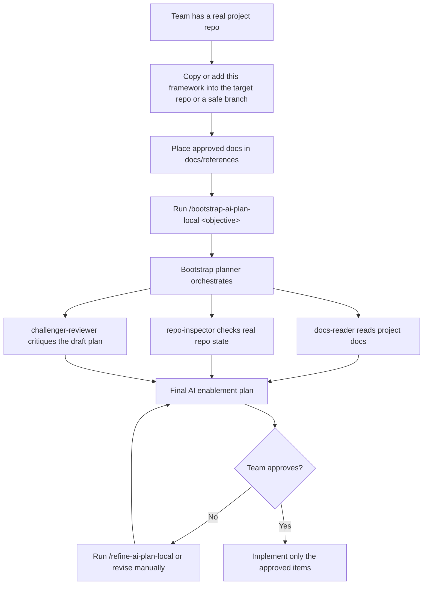
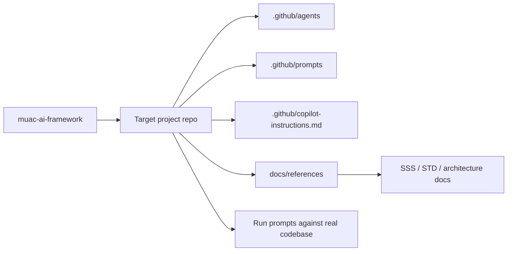

# 🧭 MUAC AI Framework — Visual Overview

> **A bootstrap AI planning flow for engineering teams.**
> Plan before you build. Evaluate every candidate AI asset against your real objective, your real repo, and your approved docs. Implement only what was explicitly approved.

[](https://github.com/ErkanBarin/muac-ai-framework)
[](#-the-three-modes-at-a-glance)
[](#-the-approval-gate)
[](#-what-gets-installed-when-you-approve)

---

## 🎯 The three modes at a glance

| | **🗂️ Plan** | **🔎 Evaluate & Shortlist** | **🚀 Implement** |
|---|---|---|---|
| **What happens** | State your objective. The planner reads approved docs + inspects your repo + drafts a focused plan. | Every candidate is scored on objective fit, repo evidence, doc evidence, and maintenance cost — then classified. | After your explicit approval, only the approved AI scaffolding files are created. |
| **Command** | `/bootstrap-ai-plan-local <objective>` | (runs automatically inside planning) | `/implement-ai-plan-local <scope>` |
| **Creates files?** | ❌ No | ❌ No | ✅ Yes — only approved ones |
| **Touches app code?** | ❌ No | ❌ No | ❌ Never |

---

## 🧭 How teams use the framework



---

## ⚡ Quick Start

> 💡 **The usage pattern**: invoke every prompt **with your objective in the same request**.
> `/<prompt-name> <objective>`

<details>
<summary><b>Step 1 — Put this framework in a real repo</b></summary>

Copy the framework into a **real target repository** or a safe branch of it.

> ⚠️ **Avoid meta-planning**: don't point the framework at this scaffold itself — the planner will only describe the scaffold. Always use a real target repo.
</details>

<details>
<summary><b>Step 2 — Add approved docs</b></summary>

Place the approved project documents under `docs/references/`. Typical items:

- 📄 System Specification Summary (SSS)
- 🧪 System Test Description (STD)
- 🏛️ Architecture notes
</details>

<details open>
<summary><b>Step 3 — Run the bootstrap planner</b></summary>

Examples:

```text
/bootstrap-ai-plan-local I want UI test automation for this repo
```

```text
/bootstrap-ai-plan-local I need backend/API test support
```

```text
/bootstrap-ai-plan-local I want agents and skills to help implement feature X
```

The prompt evaluates every candidate asset against your objective, the repo, and your approved docs — then produces a shortlist.
</details>

<details>
<summary><b>Step 4 — Optionally refine</b></summary>

Narrow the focus further:

```text
/refine-ai-plan-local Focus the plan only on UI test automation for role-based workflows
```
</details>

<details>
<summary><b>Step 5 — Review</b></summary>

Read the plan carefully. Look at the **Candidate Asset Evaluation** section to see which items were recommended, deferred, or rejected — and why.
</details>

<details>
<summary><b>Step 6 — Approve (only if satisfied)</b></summary>

Nothing is created until you explicitly approve in chat.
</details>

<details>
<summary><b>Step 7 — Implement the approved scope</b></summary>

```text
/implement-ai-plan-local Approve and implement only the recommended repo instructions and UI testing skill
```

The implementation prompt creates **only** the items you explicitly approved. It will not invent extras.
</details>

---

## 🧩 The three subagents

The planner is a three-subagent orchestration. You never call them directly — they run automatically inside the planning prompts.

| Subagent | Role | Provides |
|---|---|---|
| 📘 **`docs-reader`** | Summarizes approved documents under `docs/references/` | The *intent* view: what the target system is supposed to do |
| 🔍 **`repo-inspector`** | Inspects the actual repo — structure, tooling, tests, conventions | The *reality* view: what actually exists today |
| ⚔️ **`challenger-reviewer`** | Critiques the draft plan for weak assumptions, overengineering, and missing risks | A dedicated skeptic that runs **before** the plan is shown for approval |

---

## 📦 What gets copied where



---

## 🧪 The decision rubric

Every candidate AI asset is evaluated on four axes before any recommendation is made:

| Axis | Question |
|---|---|
| 🎯 **Objective fit** | How well does it support the stated goal? |
| 📂 **Repo evidence** | Does the codebase support or need it? |
| 📄 **Doc evidence** | Do the approved references justify it? |
| 🔧 **Maintenance cost** | Low / medium / high? |

Each candidate is then classified:

| Decision | Meaning |
|---|---|
| ✅ **`recommend now`** | Clear fit, strong evidence, acceptable cost — ships in the final shortlist |
| 🕓 **`defer`** | Plausible but not justified yet, or cost too high for today's value |
| ❌ **`reject`** | No meaningful fit with the objective or evidence |

**Only `recommend now` items reach the final `# Recommended AI Assets` shortlist.**

---

## 🛡️ The approval gate

> 🔒 **Nothing is created without your explicit approval in chat.**
> If the approval scope is unclear, the implementation flow **stops and asks** rather than guessing. This is deliberate — the cost of a bad file creation is higher than the cost of asking.

---

## 🏗️ What gets installed (when you approve)

### ✅ Allowed locations

| Type | Location |
|---|---|
| Repo-wide Copilot instructions | `.github/copilot-instructions.md` |
| Path-specific instructions | `.github/instructions/*.instructions.md` |
| Agents | `.github/agents/*.md` |
| Skills | `.github/skills/**` |
| Prompts | `.github/prompts/*.md` |
| Approved MCP guidance | *if explicitly approved* |

### ❌ Never touched

- Application source code
- Dependency manifests (`package.json`, `requirements.txt`, etc.)
- CI/CD workflows
- Anything the user didn't approve

---

## 🧱 Core principles

1. **Plan first.** Always produce a reviewable plan before any change.
2. **Approval first.** Nothing is created without explicit user approval in chat.
3. **Minimum useful setup.** Prefer the smallest set of AI assets that supports the stated objective.
4. **Evidence over enthusiasm.** Every candidate must justify itself against objective, repo, and docs.
5. **Deliberate separation.** Planning prompts never create files; implementation prompts never re-plan.

---

## 🔭 Future mode

When **WorkIQ** is available, the same framework can consume approved enterprise sources such as Confluence or Microsoft 365 content in addition to local `docs/references/`. The evaluation rubric and approval gate stay exactly the same — only the source of approved docs expands.

---

## 🧾 In plain English

- This framework is **not** the final solution for every team.
- A team uses it **inside a real project repo** or a safe branch.
- The team adds approved docs under `docs/references/`.
- The prompts **generate a plan first**.
- The team **reviews the plan**.
- **Only approved items** should be implemented.

---

<sub>Repository · <a href="https://github.com/ErkanBarin/muac-ai-framework">ErkanBarin/muac-ai-framework</a></sub>
