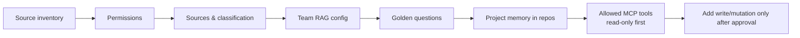
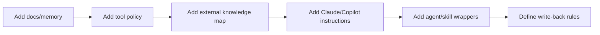
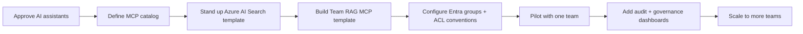

# 🚀 Quickstart

Audience: **team lead**, **engineer**, **QA engineer**, and **platform/admin**.

This page is the practical on-ramp. For the architectural picture see [`OVERVIEW.md`](OVERVIEW.md).

---

## For a team (onboarding a new domain)



1. **Copy** [`templates/team-onboarding/`](templates/team-onboarding/) into a new place owned by the team (could be a new repo, a Confluence page, or a shared folder).
2. **Fill** [`team-source-inventory.yml`](templates/team-onboarding/team-source-inventory.yml) — list every authoritative source.
3. **Define** [`permissions.yml`](templates/team-onboarding/permissions.yml) — Entra ID groups and roles.
4. **Choose** which sources are *synced*, *federated*, *team-RAG*, or *repo memory*.
5. **Create** [`team-rag-config.yml`](templates/team-onboarding/team-rag-config.yml) — index name, sources, ACL mode, ingestion cadence.
6. **Define** [`golden-questions.yml`](templates/team-onboarding/golden-questions.yml) — retrieval and permission tests.
7. **Set up** project memory in each repo — see [`docs/project-memory-pattern.md`](docs/project-memory-pattern.md).
8. **Define** [`tools-policy.yml`](templates/team-onboarding/tools-policy.yml) — which MCP tools are allowed.
9. **Start with read-only workflows.** Verify retrieval and permission tests work before exposing any write tools.
10. **Add write/mutation tools only after approval** with audit logging in place.

A worked example for an SRS team is in [`examples/srs-team-rag/`](examples/srs-team-rag/). For a side-by-side, conceptual ACL-trimming walkthrough, see [`examples/local-permission-demo/`](examples/local-permission-demo/).

For deeper governance reading: [`docs/connectors-and-rag-options.md`](docs/connectors-and-rag-options.md), [`docs/permission-model.md`](docs/permission-model.md), [`docs/tool-policy.md`](docs/tool-policy.md), and the phase-by-phase [`docs/implementation-roadmap.md`](docs/implementation-roadmap.md).

---

## For a project repo (engineer / QA)



1. **Add** `docs/memory/` with the structure from [`docs/project-memory-pattern.md`](docs/project-memory-pattern.md).
2. **Add** `docs/tool-policy.md` describing which MCP tools the repo's agents may use.
3. **Add** `docs/external-knowledge.md` — the map of "what lives in Team RAG / Confluence / Work IQ vs what lives in this repo".
4. **Add** AI assistant instructions:
   - GitHub Copilot: `.github/copilot-instructions.md`, `.github/prompts/`, `.github/agents/`
   - Claude Code: `.claude/agents/`, `.claude/skills/`, `.claude/commands/`
5. **Add** a small set of agents and skills tied to the repo's purpose. See [`docs/agent-skill-model.md`](docs/agent-skill-model.md).
6. **Define** write-back rules — when a finding becomes durable, where does it go (repo memory, team RAG ingestion source, Jira, Confluence).

If you don't know which agents/skills you need, run the **bootstrap planner** in this repo:

```text
/bootstrap-ai-plan-local I want UI test automation for this repo
```

It analyzes your docs + repo + objective, evaluates candidate assets, and produces a shortlist for your approval. See [`README.md`](README.md) for the full plan-first, approval-first workflow.

---

## For the platform / admin team



1. **Decide approved AI assistants.** Recommended starting pair: Claude Code via MS Foundry + GitHub Copilot Enterprise.
2. **Approve enterprise context layer.** M365 Copilot connectors and/or Work IQ.
3. **Approve MCP catalog.** Use [`docs/mcp-catalog.md`](docs/mcp-catalog.md) as the starting list. Set tiers and approval workflows.
4. **Stand up the Team RAG platform.** Azure AI Search index template + ingestion pipeline + reusable Team RAG MCP.
5. **Define Entra group conventions** — naming, who manages membership, how `allowedGroups` maps to ACLs.
6. **Pilot with one team** (the SRS example in this repo is a walkthrough). Run golden questions and permission tests.
7. **Add audit and governance dashboards** — tool calls, write actions, mutation events.
8. **Scale**: onboard the next team, then the next.

---

## What "done" looks like for a pilot

- [ ] Team source inventory filled in
- [ ] Sources classified L0 – L4
- [ ] At least one synced connector configured
- [ ] At least one federated connector configured (for sensitive sources)
- [ ] One team Azure AI Search index live with ACL metadata
- [ ] Team RAG MCP exposing search tools to the assistant
- [ ] At least 10 golden questions, half of them permission-edge cases
- [ ] At least one repo using `docs/memory/*` with a working write-back loop
- [ ] Approved MCP tools list in place, all read-only at first
- [ ] Audit logging enabled for tool calls above the agreed risk threshold
- [ ] Documented escalation path for mutating actions

---

## Common pitfalls to avoid

- ❌ Building one giant index of "everything"
- ❌ Copying all department docs into every repo
- ❌ Letting the assistant install MCP servers itself
- ❌ Defaulting any tool to write/mutation
- ❌ Indexing secrets, credentials, or unrestricted PII
- ❌ Letting the assistant summarize content the user cannot access
- ❌ Building emulators or active injectors before passive observation is in place
