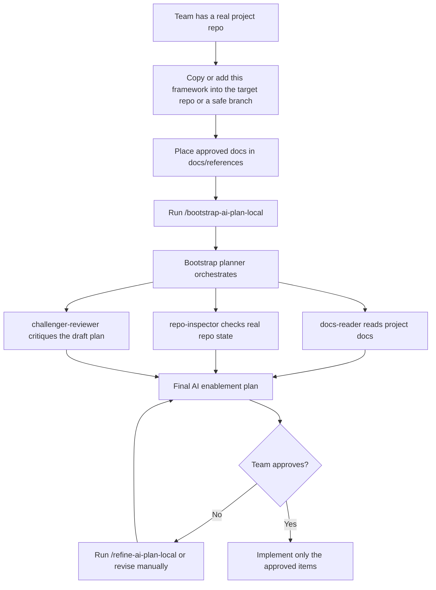
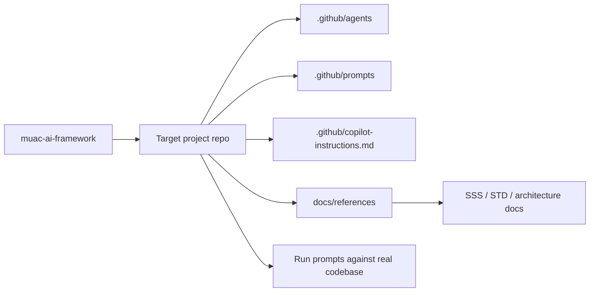

# MUAC AI Framework

This repository provides a bootstrap AI planning flow for engineering teams.

It is an **AI planning and bootstrap scaffold**, not an application codebase. Its purpose is to help teams analyze their project context, inspect real repository state, and produce a low-noise AI enablement plan before any implementation.

## Current mode
- Teams place approved project documents under `docs/references/`
- The bootstrap planner analyzes those documents and the target project repository
- The planner evaluates every candidate AI asset against the user's stated objective, repository evidence, and document evidence **before** producing any recommendation
- Only then does the agent produce the final AI enablement plan with a shortlist of assets
- The plan can then be reviewed, challenged, approved, and optionally implemented

## Quick Start
1. Copy this framework into a **real target repository** or a safe branch of that repository.
2. Place approved project documents under `docs/references/`.
3. Run the `/bootstrap-ai-plan-local` prompt to generate a draft AI enablement plan. **State your objective clearly when you run it** — for example: *"I want UI test automation for this repo"*, *"I need backend/API test support"*, or *"I want agents and skills to help implement feature X"*. The prompt evaluates every candidate asset against your objective, repo evidence, and document evidence, then recommends only the strongest shortlist.
4. Optionally run `/refine-ai-plan-local` to tighten the plan further.
5. Review the plan carefully.
6. Approve implementation only if you are satisfied — nothing should be created or modified without explicit approval.
7. Once approved, run `/implement-ai-plan-local` to apply only the approved items.

> **Note:** This framework is best used against a **separate target repository** containing real application code. Pointing it at this scaffold itself will mostly describe the scaffold.

## How other teams use this framework

## In plain English

- This framework is not the final solution for every team.
- A team uses it inside a real project repo or a safe branch of that repo.
- The team adds approved docs under `docs/references/`.
- The prompts generate a plan first.
- The team reviews the plan.
- Only approved items should be implemented.

## What gets copied where

## What runs under the hood
The `/bootstrap-ai-plan-local` and `/refine-ai-plan-local` prompts both delegate to the `bootstrap-planner` agent, which internally orchestrates three subagents:
- `docs-reader` — summarizes approved documents under `docs/references/`
- `repo-inspector` — inspects the actual repository state
- `challenger-reviewer` — critiques the draft plan for weak assumptions and overengineering before it is shown for approval

You do not invoke these subagents directly; they run as part of the planning flow.

## How recommendations are decided
The planner does not recommend AI assets loosely. It first evaluates every candidate instruction, skill, agent, prompt, and approved MCP guidance item, then decides what to keep.

Each candidate is judged against:
- the user's **stated objective**
- **repo evidence** — does the actual codebase support or need it?
- **document evidence** — do the approved references justify it?
- **maintenance cost** — low / medium / high

Each candidate is then classified as:
- **recommend now** — clear fit, strong evidence, acceptable cost
- **defer** — plausible but not justified yet, or cost too high for today's value
- **reject** — no meaningful fit with the objective or evidence

Only `recommend now` items appear in the final shortlist.

## Implementation mode
Planning and implementation are deliberately separated:

- The planning prompts (`/bootstrap-ai-plan-local`, `/refine-ai-plan-local`) only produce and refine a plan. They do not create files.
- The implementation prompt (`/implement-ai-plan-local`) applies **only the items that were explicitly approved** in the current chat.
- Implementation mode is intentionally restricted to AI scaffolding files — copilot instructions, path-specific instruction files, agents, skills, prompts, and approved MCP guidance.
- Application source code, dependency manifests, and CI/CD configuration are out of scope for this framework.

If approval is unclear, the implementation flow stops and asks for clarification rather than guessing.

## Future mode
When WorkIQ is available, the same framework can use approved enterprise sources such as Confluence or Microsoft 365 content instead of or in addition to local reference documents.

## Principles
- Plan first
- Do not modify project repositories automatically
- Ask for approval before any implementation
- Evaluate every candidate AI asset against the stated objective, repo evidence, and document evidence before recommending it
