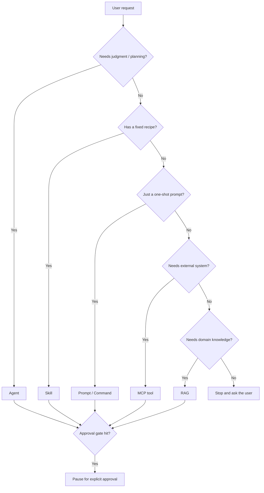

# 🤝 Agent / Skill / Prompt / MCP / RAG Model

How to structure AI assets in a repo so they stay maintainable, vendor-aware, and not vendor-locked.

---

## The five primitives

| Primitive | What it is | Best when |
|---|---|---|
| **Agent** | A persona with rules + an orchestration loop | The work needs *judgment*: planning, reviewing, deciding |
| **Skill** | A repeatable, parameterized capability | The work has a *recipe*: deterministic steps with inputs/outputs |
| **Prompt / Command** | A user-invokable entry point | A repeatable *user gesture* triggers an agent or skill |
| **MCP tool** | A controlled bridge to an external system | The assistant needs a *side effect* or live data |
| **RAG** | Permission-aware retrieval | The assistant needs *knowledge* it doesn't already have |

**Decision rule:** *Agents think. Skills do. Prompts trigger. MCPs reach out. RAG looks up.*

---

## Side-by-side: how the same idea maps across tools

| Concept | Claude Code | GitHub Copilot | Tool-agnostic / shared |
|---|---|---|---|
| Persona / orchestration | `.claude/agents/<name>.md` | `.github/agents/<name>.agent.md` | docs describe role + rules |
| Repeatable capability | `.claude/skills/<name>/` | (skills surfaced via prompts/agents) | scripts + docs in repo |
| User-invokable entry | `.claude/commands/<name>.md` | `.github/prompts/<name>.prompt.md` | both forms can coexist |
| Repo-wide instructions | `CLAUDE.md` | `.github/copilot-instructions.md` | both forms can coexist |
| Memory | `docs/memory/*` | `docs/memory/*` | shared by both |
| Tool policy | `docs/tool-policy.md` | `docs/tool-policy.md` | shared by both |
| External knowledge map | `docs/external-knowledge.md` | `docs/external-knowledge.md` | shared by both |

The shared `docs/*` is intentional: it's the one source of truth that any AI assistant in this repo can read.

---

## Recommended common roles

A starting set of agent roles most teams benefit from:

| Role | One-line job | Trigger |
|---|---|---|
| **orchestrator** | Coordinates other agents to produce a deliverable | High-level user request |
| **repo-keeper** | Knows the repo's structure, conventions, and memory | Any agent needing repo context |
| **domain-explorer** | Reaches into Team RAG / Work IQ for domain knowledge | When project memory isn't enough |
| **test-designer** | Plans coverage and proposes test cases | Before adding a feature |
| **flake-debugger** | Diagnoses flaky tests using logs + repo memory | On test failure |
| **docs-updater** | Writes back durable findings into the right layer | After a confirmed result |
| **security-reviewer** | Spot-checks proposed changes for safety/compliance issues | Before approval of write actions |
| **rag-query-agent** | Permission-aware retrieval over team RAG | When the orchestrator needs context |
| **mcp-tool-router** | Picks the right MCP tool, enforces tier policy | When a live system fact is needed |

A team rarely needs all of these on day one. Start with **orchestrator + repo-keeper + 1 domain-specific role**.

---

## When to use what

| Situation | Use |
|---|---|
| "Plan how we should approach X" | **agent** (orchestrator + reviewer) |
| "Run our standard 'add a Playwright test for route Y' recipe" | **skill** |
| "Open the planning prompt with my objective" | **prompt / command** |
| "Get the last 50 lines of the failing pipeline log" | **MCP tool** |
| "What does our SRS ICD say about ack messages?" | **RAG (Team RAG MCP)** |
| "I'm not sure what scope this PR should cover" | **stop and ask** |

---

## When to stop and ask

The agent **must** stop and ask before:

- Creating or modifying any file (per repo policy)
- Calling any tool above tier 3
- Using a write or mutation MCP tool
- Acting on ambiguous approval scope
- Touching application source, dependency manifests, or CI/CD config (out of scope)
- Operating on data the user can't directly see

The cost of asking is one chat turn. The cost of guessing wrong can be a broken build, a bad PR comment, or a leaked document.

---

## How this repo's bootstrap planner fits the model

The existing planner workflow ([`README.md`](../README.md), [`OVERVIEW.md`](../OVERVIEW.md)) is a worked example of this model:

| Asset | Type | Role |
|---|---|---|
| `bootstrap-planner.agent.md` | agent | Orchestrator |
| `docs-reader.agent.md` | agent (sub) | Reads `docs/references/` |
| `repo-inspector.agent.md` | agent (sub) | Inspects repo state |
| `challenger-reviewer.agent.md` | agent (sub) | Critiques the draft |
| `implementation-generator.agent.md` | agent | Applies approved scaffold only |
| `bootstrap-ai-plan-local.prompt.md` | prompt | User-invokable entry |
| `refine-ai-plan-local.prompt.md` | prompt | Refinement entry |
| `implement-ai-plan-local.prompt.md` | prompt | Approved-implementation entry |
| `.github/copilot-instructions.md` | instructions | Repo-wide rules |
| `docs/references/` | knowledge inputs | Approved project documents |

It's a small, working demonstration of the same pattern teams should use for their own agents and skills.

---

## Anti-patterns to avoid

- ❌ Building 12 agents on day one. Start with the orchestrator and one specialist.
- ❌ Hard-coding the same long preamble into every agent. Put shared context in `docs/memory/` and link to it.
- ❌ Bypassing approval gates "because the agent already knows what to do".
- ❌ Mixing planning and implementation in the same agent. Keep them separate (this repo does it deliberately).
- ❌ Letting agents pick their own MCP tools. Define `docs/tool-policy.md` and enforce it.
- ❌ Skipping the "external knowledge map" step. Without it, agents will reinvent answers that already exist in Team RAG.
