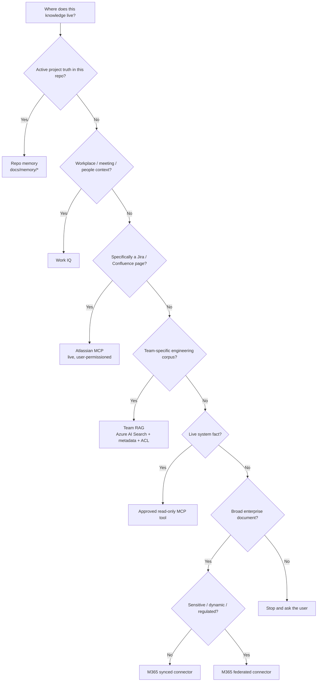

# 🔌 Connectors & RAG Options — How the Sources Differ

A practical breakdown of the retrieval and live-access options an AI-assisted engineering platform can offer, and **when each one is the right answer**.

> *This is a recommended decision guide, not an approval. Each option still needs platform/security review before enablement.*

---

## Why this page exists

Teams keep collapsing very different things into the same word:

- *"Just RAG it"* — but **Atlassian MCP** is **not** Team RAG.
- *"Use Copilot"* — but **synced** vs **federated** connectors behave very differently.
- *"Index everything"* — but **live MCP tools** should not be indexed at all.

This page draws those lines clearly so the team can pick the right retrieval option per source.

---

## The six options at a glance

| # | Option | What it really is | One-line use |
|---|---|---|---|
| 1 | **Microsoft 365 synced connectors** | Content **indexed into Microsoft Graph** | Broad enterprise knowledge that's safe to index |
| 2 | **Microsoft 365 federated connectors / federated MCP** | Source queried **live**, not indexed | Sensitive or rapidly changing content |
| 3 | **Work IQ** | Microsoft 365 **context bridge** for Teams, meetings, mail, SharePoint, people | Workplace context, "who said what when" |
| 4 | **Atlassian MCP** (Rovo / Remote MCP) | **Live doorway** into Jira/Confluence using the user's permissions | Atlassian-specific live questions |
| 5 | **Team RAG** (Azure AI Search) | **Curated engineering index**, metadata-rich, ACL-filtered | Domain-deep team knowledge with metadata |
| 6 | **Repo memory** + **Live MCP tools** | Active project truth · live system facts | Current implementation truth · DB/log/CI/Azure facts |

---

## Decision tree

---

## The full comparison table

| Source | Best retrieval option | Where data is indexed or stored | How the assistant reaches it | Best use | Risk notes |
|---|---|---|---|---|---|
| Broad Confluence/SharePoint/OneDrive content (general internal) | **M365 synced connector** | Microsoft Graph index | M365 Copilot / Work IQ | Onboarding docs, coding standards, policies, broad enterprise knowledge | Anything indexed inherits Graph governance — don't sync sensitive content |
| Sensitive or rapidly-changing enterprise sources | **M365 federated connector** | Stays in source; queried live per call | M365 Copilot via federation | Security-risk docs, regulated content, content that must not be copied | Latency higher; depends on source uptime; access decisions live |
| Teams chats, meetings, mail, SharePoint, people graph, recent enterprise context | **Work IQ** | Microsoft 365 (Graph + connectors) | M365 Copilot / Work IQ MCP | "When did we decide X?", "Who owns Y?", "What was discussed in last week's review?" | Permission-trimmed; never summarize meetings the user wasn't in |
| Live Jira/Confluence pages & tickets | **Atlassian MCP** (Rovo / Remote MCP) | Stays in Atlassian; live calls | MCP server, user OAuth | "Show open SRS bugs", "Pull the latest version of this Confluence page" | Live ACL — the user's own Atlassian permissions apply |
| Team domain corpus: ICDs, architecture, testability, interface specs, requirement IDs | **Team RAG** | Azure AI Search team index (chunks + metadata + ACL) | Team RAG MCP | Metadata-rich retrieval: by requirement, interface, feature, testability | Must filter by Entra group ACL **before** chunks reach the model |
| Active project truth: coverage, blockers, decisions, selectors, route map | **Repo memory** | Markdown in the repo (`docs/memory/*`) | Direct file read by the assistant | Current implementation truth, "what we just decided" | Must not contain restricted (L3+) content |
| Live system facts: DB rows, logs, CI status, Azure resource state, browser state | **Live MCP tools** | **No copy** — queried at the source | Approved read-only MCP servers | "Why did the last build fail?", "What's the current status code?" | Read-only first; mutation is a separate, gated step |

---

## "Atlassian MCP is *not* Team RAG"

This is the most common confusion and the most expensive one.

| Aspect | Atlassian MCP | Team RAG |
|---|---|---|
| What it is | A **live MCP doorway** into Jira/Confluence | A **curated index** in Azure AI Search |
| Who decides what's visible | The **user's own Atlassian permissions** (live) | The team-defined **ACL metadata** + Entra groups (at index time) |
| Freshness | Always current | As fresh as the last ingestion run |
| Metadata available | Atlassian-native (project, space, labels) | Engineering metadata: `requirementId`, `interface`, `testLane`, `safetyImpact`, `component` |
| Best at | "Pull the latest version of this Jira/Confluence object" | "Find all testability notes for feature X" |
| Worst at | Cross-source semantic search with engineering metadata | Real-time ticket status |
| Write capability | Possible, **gated + audited** | Read-only — write-back happens by re-ingesting source docs |

**Use Atlassian MCP when** the question is about a specific Jira/Confluence object the user already has access to.

**Use Team RAG when** the question needs structured retrieval across the team's whole engineering corpus by metadata (requirement, interface, testability) — and that corpus may include sources outside Atlassian.

They're complementary. A team can use both.

---

## "Repo memory is *not* a company document store"

| Aspect | Repo memory | Team RAG | M365 connectors |
|---|---|---|---|
| Owner | The repo (project team) | The team | The platform team / org |
| Truth horizon | This sprint / this release | The team's domain | Org-wide |
| Volatility | High (changes daily) | Medium (changes weekly) | Low (changes monthly) |
| Sensitivity ceiling | L1 (or L2 if the repo itself is restricted) | Up to L2 (rarely L3 with strict ACL) | L0 / L1 broadly; L2+ via federation only |
| What goes here | Coverage, blockers, decisions, selectors, route map | ICDs, architecture, testability, interface specs | Onboarding docs, policies, general knowledge |
| What does **not** go here | Mirrors of company docs | Active project state | Sensitive engineering specs |

**Rule of thumb:** *the more sensitive the document, the less it should be copied.*

---

## "Live MCP tools are *not* RAG"

RAG retrieves **documents**. Live MCP tools retrieve **facts from running systems**.

| You want… | You don't use RAG, you use… |
|---|---|
| The current row in a table | Read-only DB MCP (against an approved view) |
| The current state of a pipeline | CI / CD MCP |
| The error rate over the last hour | Observability / Logs MCP |
| The current Azure resource configuration | Azure MCP |
| The DOM of a running test page | Playwright MCP |

If you index any of these, you're indexing a snapshot that's already wrong. Query live, with a read-only tool, with audit logging.

For the schema/metadata *describing* a database — yes, that can be indexed (in Team RAG). Just not the rows.

---

## Picking an option for a new source — checklist

For every source a team brings in, answer these in order:

1. **Sensitivity** — L0 / L1 / L2 / L3 / L4? *(L4 → no AI access by default.)*
2. **Volatility** — daily / weekly / monthly / rarely?
3. **Volume** — does the user community need broad or narrow access?
4. **Engineering metadata** — does retrieval need `requirementId` / `interface` / `testability`? *(Yes → Team RAG.)*
5. **Authoritative system** — Atlassian? *(Then prefer Atlassian MCP for that source's live operations, plus Team RAG if you need cross-source metadata.)*
6. **Already in M365?** *(Then a connector — synced if non-sensitive, federated if sensitive.)*
7. **Is it actually a live system, not a document?** *(Then live MCP, not RAG.)*

The output is one row in [`templates/team-onboarding/team-source-inventory.yml`](../templates/team-onboarding/team-source-inventory.yml).

---

## Anti-patterns to avoid

- ❌ Treating Atlassian MCP as a substitute for Team RAG (you lose engineering metadata).
- ❌ Treating Team RAG as a substitute for Atlassian MCP (you'll get stale tickets).
- ❌ Indexing live system data into RAG instead of using a live MCP tool.
- ❌ Putting company-wide docs in Team RAG instead of using M365 connectors.
- ❌ Putting team docs in repo memory instead of Team RAG.
- ❌ Synced-connecting a sensitive source that should be federated.
- ❌ Letting the assistant pick which option to use without a `docs/external-knowledge.md` map.

---

## Related pages

- [Permission model](permission-model.md) — how ACL trimming works across these options
- [Team RAG framework](team-rag-framework.md) — full Team RAG build pattern
- [MCP catalog](mcp-catalog.md) — approved MCP tools per tier
- [External knowledge map](external-knowledge.md) — how a repo declares which option to use per question type
- [Project memory pattern](project-memory-pattern.md) — what belongs in repo memory
