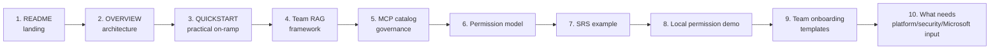

# 🎬 Demo Script — 10-Minute Walkthrough

A step-by-step way to present this repo to the MUAC AI exploration working group, a platform/security stakeholder, or a candidate pilot team.

> *This is a recommended demo flow. Adjust order and depth based on the audience. The repo content is a proposal-grade boilerplate — nothing here implies any tool or vendor has been formally approved.*

---

## Audience and intent

| Audience | Their main question | What this repo answers |
|---|---|---|
| **Exploration working group** | *"What is the shape of the platform we'd build?"* | The OVERVIEW + Team RAG + MCP catalog |
| **Platform / security** | *"What's the governance and permission model?"* | Permission model + tool policy + MCP catalog |
| **Candidate pilot team** | *"What do I copy on Monday?"* | Quickstart + templates + SRS example |
| **Management / sponsor** | *"What are we deciding, and what needs external help?"* | Implementation roadmap |

The flow below works for a mixed audience. For a single-stakeholder demo, lean harder into their column.

---

## The 10-minute demo flow

Aim for ~1 minute per step. Don't read the docs aloud — point at the **shape** of each file and what it answers.

---

### Step 1 (0:00–1:00) — Open the README landing page

**Open:** [`README.md`](../README.md)

**Talk track:**
> *"This is the entry point. It's a proposal-grade boilerplate — a reusable, governed pattern teams can copy and adapt. Nothing in this repo implies that any tool, vendor, or integration has been formally approved by MUAC. The README is the navigation layer. Everything important is one click away."*

**Show:**
- The "Where to go next" table.
- The eight core principles.

---

### Step 2 (1:00–2:00) — Show the OVERVIEW architecture diagram

**Open:** [`OVERVIEW.md`](../OVERVIEW.md)

**Talk track:**
> *"This is the one-page architectural picture. The headline message: don't pick one chatbot — build a secure AI-assisted engineering platform with approved assistants, governed MCP tools, enterprise/team RAG, project memory, and write-back discipline."*

**Show:**
- The full enterprise architecture diagram.
- The memory hierarchy table — *the right knowledge in the right place*.

---

### Step 3 (2:00–3:00) — Show the QUICKSTART

**Open:** [`QUICKSTART.md`](../QUICKSTART.md)

**Talk track:**
> *"For people who want to do something today, the quickstart has three audiences: a team onboarding a domain, a project repo, and the platform/admin team. Each has its own concrete checklist."*

**Show:**
- The three audience headers.
- The "what 'done' looks like for a pilot" checklist.

---

### Step 4 (3:00–4:00) — Show the Team RAG framework

**Open:** [`docs/team-rag-framework.md`](team-rag-framework.md)

**Talk track:**
> *"Team RAG is one of the four memory layers. It's the team's curated, metadata-rich, ACL-filtered engineering corpus — distinct from M365 connectors and distinct from live MCP tools. This page is the build pattern: source inventory, classify, ingest with metadata + ACL, expose via a Team RAG MCP, run golden questions, then go live."*

**Show:**
- The 11-step build flow.
- The metadata example.
- The Team RAG MCP tool surface (`search_team_docs`, `find_requirement`, `find_interface`, …).

---

### Step 5 (4:00–5:00) — Show the MCP catalog and governance tiers

**Open:** [`docs/mcp-catalog.md`](mcp-catalog.md)

**Talk track:**
> *"This is the proposed MCP allowlist with tiers. Read tools are broadly allowed. Write tools require approval. Mutation tools require explicit gates and audit. Secrets and L4 content are never exposed to agents."*

**Show:**
- The tier diagram.
- The recommended catalog table.
- The approval workflow.

---

### Step 6 (5:00–6:00) — Show the permission model

**Open:** [`docs/permission-model.md`](permission-model.md)

**Talk track:**
> *"This is how a user from another team is blocked from restricted documents. Five layers of access control: Entra groups, source ACLs, Atlassian permission trimming, M365 connector trimming, and Azure AI Search ACL filtering. The model never sees a chunk the user can't access — so it can't leak by paraphrase."*

**Show:**
- The end-to-end flow diagram.
- The classification table (L0–L4).
- The "what must never happen" list.

---

### Step 7 (6:00–7:00) — Show the SRS worked example

**Open:** [`examples/srs-team-rag/`](../examples/srs-team-rag/)

**Talk track:**
> *"SRS is the example team. This kit is what a team would copy into their own workspace. It's a filled-in version of the templates: source inventory, RAG config, metadata examples, golden questions, and an end-to-end agent workflow."*

**Show:**
- [`examples/srs-team-rag/README.md`](../examples/srs-team-rag/README.md) — the SRS overview.
- [`examples/srs-team-rag/srs-golden-questions.yml`](../examples/srs-team-rag/srs-golden-questions.yml) — including a permission-edge case.

---

### Step 8 (7:00–8:00) — Run the local permission demo

**Open:** [`examples/local-permission-demo/`](../examples/local-permission-demo/)

**Talk track:**
> *"This is a markdown/JSON walkthrough — not a real RAG service — that makes the permission trimming visible. Same query, four users, four different allowed result sets. L4 content isn't even in the index."*

**Show:**
- [`examples/local-permission-demo/sample-index.json`](../examples/local-permission-demo/sample-index.json) — point at `allowedGroups`.
- [`examples/local-permission-demo/expected-results.md`](../examples/local-permission-demo/expected-results.md) — the per-user summary table.

This is the most concrete moment in the demo. It turns "we'll filter by ACL" into a side-by-side artifact.

---

### Step 9 (8:00–9:00) — Show the team onboarding templates

**Open:** [`templates/team-onboarding/`](../templates/team-onboarding/)

**Talk track:**
> *"This is what a new team copies. Source inventory, permissions, Team RAG config, golden questions, tools policy, write-back policy. Filling these in is the team's onboarding work."*

**Show:**
- [`templates/team-onboarding/team-source-inventory.yml`](../templates/team-onboarding/team-source-inventory.yml).
- [`templates/team-onboarding/permissions.yml`](../templates/team-onboarding/permissions.yml).
- [`templates/team-onboarding/tools-policy.yml`](../templates/team-onboarding/tools-policy.yml).

---

### Step 10 (9:00–10:00) — Close with "what needs platform/security/Microsoft input"

**Open:** [`docs/implementation-roadmap.md`](implementation-roadmap.md)

**Talk track:**
> *"This is what the org has to decide and where external help is recommended. Phase 0 is governance — model approvals, classification, MCP policy, identity, audit. Phase 1 is source inventory across all teams. Phase 2 is a platform MVP. Phase 3 is pilots — recommended trio: SRS, QA, and a DB or infra team. Phases 4 and 5 are scale and production governance."*
>
> *"What needs Microsoft / Atlassian / security partner help: enterprise connector rollout, Work IQ approval, MCP catalog security review, Entra group architecture at scale. What needs management decisions: approved assistants, classification standard, mutation policy, funding model, SLA targets."*

**Show:**
- The phase diagram.
- The "what management must decide" consolidated list.

---

## Talk track — what to say at each transition

### What this repo *is*

> *"A reusable, governed pattern teams can copy. A one-page narrative for stakeholders. A set of templates a team can fill in this week. A worked example using SRS."*

### What this repo *is not*

> *"Not a deployed environment. Not a list of MUAC-approved vendors. Not a copy of any internal MUAC system. Not a replacement for security review, IAM design, or data governance."*

### What a team can copy *today*

> *"Project memory pattern. External knowledge map. Tool policy. Team onboarding templates. SRS example as a worked starting point. Local permission demo to show the trimming behavior."*

### What requires platform / security / Microsoft help

> *"Enterprise M365 connector rollout. Work IQ approval. Atlassian Rovo / Remote MCP enablement. Production Azure AI Search platform. Entra group architecture at scale. MCP catalog security review. Audit/dashboards in production. Compliance review."*

### Recommended pilot path

> *"Phase 0: governance decisions. Phase 1: source inventory across all teams. Phase 2: platform MVP with one team — SRS is the recommended starter. Phase 3: pilot trio — SRS, QA, and a DB/infra team. Phase 4: scale via templates. Phase 5: production governance."*

---

## What to skip if you only have 5 minutes

If you only have half the time, drop:

- Step 3 (Quickstart) — refer to it.
- Step 7 (SRS example) — fold a sentence about it into Step 8.
- Step 9 (templates) — refer to it from Step 8.

Keep: README → OVERVIEW → Team RAG → permission model → local permission demo → roadmap.

---

## What to add if you have 20 minutes

- Open one chunk of [`examples/srs-team-rag/srs-metadata-examples.md`](../examples/srs-team-rag/srs-metadata-examples.md) and walk through what each metadata field does.
- Open [`docs/agent-skill-model.md`](agent-skill-model.md) and show the agent/skill/prompt/MCP/RAG decomposition.
- Open [`docs/visual-architecture.md`](visual-architecture.md) and show the diagram cheat sheet.
- Open [`docs/connectors-and-rag-options.md`](connectors-and-rag-options.md) and walk through the "Atlassian MCP is *not* Team RAG" section.

---

## Closing line

End the demo with:

> *"Everything in this repo is a recommendation, not an approval. The next decision is: which pilot team, on what timeline, and with what platform support. The roadmap page lists exactly what management has to decide and where external help is recommended."*

Then ask them to pick the next decision.
