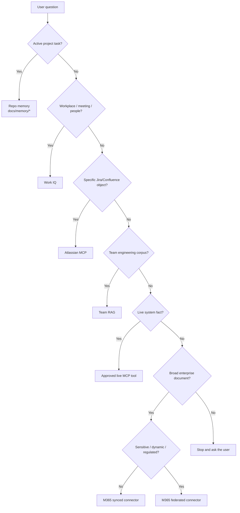

# 🗺️ External Knowledge Map

How a repo declares **which retrieval option to use for which kind of question** — without copying every external doc into the repo.

> *This is a recommended starter pattern. Each repo customizes its own external-knowledge map based on the team's actual sources.*

---

## Why this file exists

A repo's `docs/memory/*` is the **active project truth**. It is **not** a copy of the team's documents, the company's documents, or any live system state.

This page is the **routing layer**: when the assistant gets a question, which external source should it reach for?

A good `docs/external-knowledge.md` answers four questions for the assistant:

1. *Where does each kind of knowledge live?*
2. *Which retrieval option should be used for that kind?*
3. *What's authoritative vs derived?*
4. *What does the assistant **not** have access to?*

---

## When to use what — the six options

### 1. When to use Work IQ

Use **Work IQ** when the question is about **workplace context**: meetings, decisions, mail, Teams chats, SharePoint, people, ownership, recent enterprise context.

Examples:
- *"When was the last review of the SRS rollout discussed?"*
- *"Who attended last sprint's architecture sync?"*
- *"Which SharePoint page has the latest QA strategy?"*
- *"Who owns the SRS interface contract?"*

Don't use Work IQ for:
- ❌ Engineering metadata search (use Team RAG).
- ❌ Live ticket status (use Atlassian MCP).
- ❌ Active project state (use repo memory).

### 2. When to use Atlassian MCP

Use **Atlassian MCP** when the question is about **a specific Jira or Confluence object the user already has access to**.

Examples:
- *"Show me open SRS-FDPS bugs assigned to my team."*
- *"Pull the latest version of the SRS Confluence page on alert acknowledgement."*
- *"Comment on this Jira ticket once the test pack is ready."*

Don't use Atlassian MCP for:
- ❌ Cross-source semantic search with engineering metadata (use Team RAG).
- ❌ Documents outside Atlassian (use the right connector or Team RAG).
- ❌ Mutation without approval — Atlassian write actions require an explicit approval gate.

### 3. When to use Team RAG

Use **Team RAG** when the question needs **structured retrieval over the team's engineering corpus** by metadata (requirement, interface, feature, testability, safety impact).

Examples:
- *"Which document defines the SRS alert acknowledgement contract?"*
- *"Find all testability notes for the SRS-FDPS interface."*
- *"What are the L1/L2 ICDs that mention `SRS_ALERT_042`?"*
- *"Which docs are owned by `SRS-Architecture`?"*

Don't use Team RAG for:
- ❌ Live ticket status (use Atlassian MCP).
- ❌ Active project state (use repo memory).
- ❌ Live system facts (use a live MCP tool).
- ❌ L4 content — never indexed.

### 4. When to use repo memory

Use **repo memory** (`docs/memory/*`) when the question is about **active project truth**: coverage, blockers, decisions, selectors, route map, "what we just did".

Examples:
- *"Which routes are covered by the test pack today?"*
- *"What's blocking the alert-flow test?"*
- *"What did we decide about async ack writes last sprint?"*

Don't put in repo memory:
- ❌ Mirrors of company / team docs (link to them instead).
- ❌ Restricted (L3+) content.
- ❌ Credentials, secrets, PII.

### 5. When to use live MCP tools

Use **live MCP tools** when the question needs a **fact from a running system** — not a document.

Examples:
- *"What's the last status code returned from the staging environment?"*
- *"Why did the build fail on branch X?"*
- *"What's the row count in the approved view `vw_alerts_summary`?"*
- *"What's the current state of resource group X in Azure?"*

Don't use a live MCP tool for:
- ❌ Static documentation (use the right RAG / connector option).
- ❌ Anything that mutates a system without explicit approval.
- ❌ Anything that requires production data outside read-only views.

### 6. When **not** to use AI access

Some content **does not** get AI access by default:

- **L4 / secret / regulated** content (credentials, classified ops data, legally regulated content).
- Restricted **L3** content where the user lacks group membership.
- Content the source system itself denies the user.
- Production mutating actions without an approval gate.

If a request would require any of the above, the assistant should **stop and surface the access path** ([`permission-model.md`](permission-model.md)) — not retrieve it through an alternative tool.

---

## The decision tree the assistant should follow



---

## Sample repo-level external-knowledge map (SRS)

This is the kind of table a repo owned by the SRS team would put in its own `docs/external-knowledge.md`:

| Kind of question | Use | Why |
|---|---|---|
| SRS architecture / ICDs / testability / interfaces | **SRS Team RAG** | Engineering metadata retrieval (requirement, interface, testability) |
| A specific SRS Jira ticket or Confluence page | **Atlassian MCP** | Live, user-permissioned access |
| SRS meetings, decisions, ownership, recent enterprise context | **Work IQ** | Workplace context bridge |
| Current implementation truth in this repo | **Repo memory** (`docs/memory/*`) | Active project truth |
| Last status code, log line, or DB row from the test environment | **Read-only DB MCP** / **Observability MCP** | Live system fact, no copying |
| Pipeline / build status | **CI / CD MCP** | Live system fact |
| Azure resource state | **Azure MCP** (read-only) | Live system fact |
| L3 sensitive / security-risk SRS docs | **Federated retrieval only** | Stays in source, minimal summary, named groups only |
| L4 / secrets / regulated | **No AI access by default** | Approved secure process only |

For the SRS worked example, see [`examples/srs-team-rag/`](../examples/srs-team-rag/).

---

## What a *minimum* external-knowledge map looks like

If a team can only do one thing:

```markdown
# External Knowledge Map

| Kind of question | Use | Notes |
|---|---|---|
| Active project state | docs/memory/* | Coverage, blockers, decisions |
| Team engineering docs (ICDs, architecture, testability) | <Team> RAG | via Team RAG MCP |
| Specific Jira/Confluence object | Atlassian MCP | live, user-permissioned |
| Live system fact (DB, log, CI, Azure) | Approved read-only MCP | never indexed |
| Sensitive / restricted content | Federated retrieval, named groups | minimal summary |
| Secrets / regulated | No AI access by default | use approved secure process |
```

That's enough for the assistant to route most questions correctly.

---

## What never goes in this map

- ❌ Real internal URLs.
- ❌ Credentials or tokens.
- ❌ Mirrored copies of restricted documents.
- ❌ A list of every Confluence page (the assistant uses retrieval; it doesn't need a directory).

The map points to **categories of knowledge**, not individual documents.

---

## Related pages

- [Connectors & RAG options](connectors-and-rag-options.md) — full comparison of the six options
- [Permission model](permission-model.md) — how ACL trimming works
- [Team RAG framework](team-rag-framework.md) — the full Team RAG build pattern
- [Project memory pattern](project-memory-pattern.md) — what belongs in repo memory
- [Tool policy](tool-policy.md) — reusable per-repo tool policy
