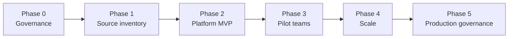
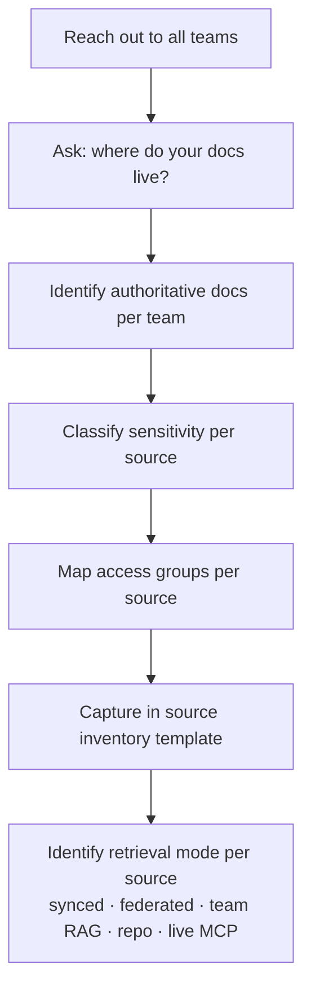
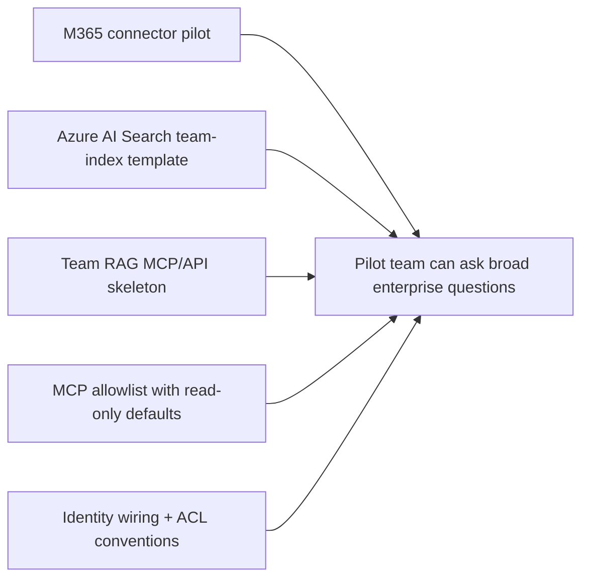
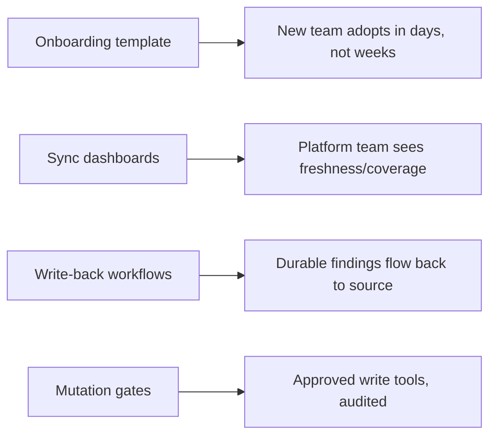

# 🛣️ Implementation Roadmap

How an organization could implement this framework from scratch — phase by phase, decision by decision.

> *Phases are recommended, not mandatory. Skip or merge phases based on actual readiness, not target dates. Nothing here implies any tool or vendor has been formally approved.*

---

## The shape of the journey

**Key idea:** governance comes **first**, not last. Building a platform without classification, identity, and audit policies is more expensive to retrofit than to design up front.

---

## Phase 0 — Governance

**Goal:** decide the rules of the game before building anything.

### Decisions to make

| Decision | Owner | Output |
|---|---|---|
| Approved AI assistants (which vendors / which entrypoints) | Platform + security + procurement | Approved-vendor list |
| Approved AI models (which models, for which classes of work) | Platform + security | Model approval matrix |
| Data classification levels (L0–L4) | Security + data governance | Classification standard |
| MCP policy (allowed tool tiers, approval gates) | Platform + security | MCP catalog with tier defaults |
| Identity & groups (Entra naming, ownership, lifecycle) | IAM | Group naming standard, lifecycle SOP |
| Audit requirements (what is logged, retention, dashboards) | Security + platform | Audit standard |
| Acceptable-use policy for AI assistants | HR + legal + security | Acceptable-use document |

### What's needed externally

- Microsoft / Atlassian / vendor agreements may need legal review.
- Data residency / regulatory boundaries may require external advisory input.

### What management must decide

- Risk appetite for **mutating** AI tools (default: read-only first).
- Budget envelope for the platform MVP and pilots.
- Which teams are eligible to pilot first (technical readiness + sponsor availability).

---

## Phase 1 — Source inventory

**Goal:** know what knowledge exists, where it lives, who owns it, and how sensitive it is — across **all teams**, not just the pilot team.

### Activities

For each team:

1. **Gather** all teams in scope. Not just engineering — also QA, ops, safety, infra, data, docs.
2. **Ask** every team where their docs and data live (Confluence spaces, SharePoint sites, Bitbucket repos, Jira projects, file shares, SaaS systems).
3. **Identify** the authoritative source for each kind of knowledge (which document is the "source of truth"?).
4. **Classify** every source against L0–L4.
5. **Map** the Entra groups that should access each source.

### What can be done internally

- Source inventory interviews with teams.
- Classification per the platform standard.
- Filling [`templates/team-onboarding/team-source-inventory.yml`](../templates/team-onboarding/team-source-inventory.yml) and [`templates/team-onboarding/permissions.yml`](../templates/team-onboarding/permissions.yml) per team.

### Where external help is recommended

- Reviewing classification with legal/regulatory advisory if any sources are regulated.
- IAM consolidation if Entra groups are inconsistent across the org.

### What management must decide

- Which teams are required to participate in inventory (mandatory vs voluntary).
- Whether legacy unclassified sources are quarantined until they can be classified.

---

## Phase 2 — Platform MVP

**Goal:** stand up the smallest possible platform that proves the pattern works for **one** team end-to-end.

### Build list

| Component | What "MVP" means |
|---|---|
| **M365 synced connector pilot** | One source synced; permission trimming verified |
| **Azure AI Search team-index template** | Reusable index schema with metadata + ACL fields |
| **Team RAG MCP/API skeleton** | One server, three or four tools (search, find requirement, find interface, find owner), ACL filter on every call |
| **MCP allowlist** | The catalog from [`docs/mcp-catalog.md`](mcp-catalog.md), all tools defaulting to read-only |
| **One pilot team** | SRS is the recommended pilot in this framework |

For a conceptual API surface, see [`templates/platform/team-rag-service/README.md`](../templates/platform/team-rag-service/README.md).

### What can be done internally

- Standing up Azure AI Search.
- Building the Team RAG MCP wrapper.
- Wiring a single M365 synced connector.
- Writing the MCP allowlist policy.

### Where external help is recommended

- Microsoft platform engineers for connector edge cases.
- Security partner for the first MCP tool review.
- Vendor support for any Atlassian Rovo / Remote MCP integration.

### What management must decide

- Which team is the **first** pilot. The SRS example assumes SRS — but any team with strong document discipline works.
- How long the MVP runs before moving to Phase 3.

---

## Phase 3 — Pilot teams

**Goal:** prove the pattern across **multiple** teams with different shapes (engineering, QA, infrastructure/data).

### Recommended pilot trio

| Pilot | Why it's a good pilot |
|---|---|
| **SRS** (engineering) | Heavy ICD/architecture corpus, clear classification |
| **QA** (across systems) | Tests permission boundaries — QA often spans teams |
| **DB or Infrastructure** | Different shape: schema/metadata RAG + live MCP, less classical document corpus |

### Per-pilot checklist

For each pilot team:

- [ ] Source inventory complete (Phase 1 output).
- [ ] Sensitivity classification reviewed.
- [ ] Team RAG index ingested.
- [ ] At least 10 golden questions, 5 of them permission-edge cases.
- [ ] At least one negative golden question (out-of-team user is denied).
- [ ] Approved MCP tools list in place, all read-only.
- [ ] Audit logging on.
- [ ] Documented escalation path for restricted-content access requests.

### What can be done internally

- Source-by-source ingestion.
- Golden-question authoring.
- Permission tests.
- Pilot-team training on the assistant.

### Where external help is recommended

- Microsoft platform engineers if connector edge cases re-appear at scale.
- Security review of the golden-question set before go-live.

### What management must decide

- Whether to add new teams sequentially or in parallel.
- How long each pilot runs before being declared "production".

---

## Phase 4 — Scale

**Goal:** make onboarding a new team a **template-driven** activity, not a project.

### Activities

| Stream | Output |
|---|---|
| Onboard more teams | Each new team uses [`templates/team-onboarding/`](../templates/team-onboarding/) |
| Sync dashboards | Index freshness, coverage, ACL drift, golden-question pass rate |
| Write-back workflows | Repo memory → Team RAG ingestion → Confluence/Jira via approved write MCP |
| Mutation gates | Tier 4–7 tools enabled per-team after security review; high-risk tools require two-person approval |

### What can be done internally

- Repeating the pilot pattern.
- Building dashboards.
- Iterating on golden questions.

### Where external help is recommended

- Cost optimization (Azure AI Search, embeddings, MCP gateway).
- Compliance/audit review at scale.

### What management must decide

- Where the **mutation** line is drawn for the org as a whole.
- Funding model: platform-owned vs charged back per team.

---

## Phase 5 — Production governance

**Goal:** the platform is now load-bearing. Treat it like any other production service.

### Activities

| Stream | Output |
|---|---|
| **Audit** | All tool calls above the agreed tier are logged and reviewed |
| **Ownership** | Platform team, security partner, IAM owner, per-team RAG owners |
| **Support model** | Tiered support: team-local → platform team → vendor |
| **Monitoring** | Index health, retrieval latency, MCP call rate, denied-due-to-ACL rate, error rate |
| **Cost management** | Embedding/storage cost per team, tool-call cost per workflow |

### What can be done internally

- Standard SRE practices: runbooks, on-call rotations, alerting.
- Cost dashboards.

### Where external help is recommended

- Annual security review.
- Vendor relationship management.

### What management must decide

- SLA targets for retrieval and tool-call latency.
- Annual budget envelope.
- When and how to evaluate alternative vendors (vendor-aware, not vendor-locked).

---

## What can be done internally vs externally — summary

| Area | Internal | External help recommended |
|---|---|---|
| Source inventory | ✅ | — |
| Classification | ✅ | Legal/regulatory advisory for regulated sources |
| Team RAG index template | ✅ | optional |
| Team RAG MCP prototype | ✅ | optional |
| M365 connector enterprise rollout | possible | recommended (Microsoft) |
| Atlassian MCP enablement | possible | recommended (Atlassian) |
| Identity / Entra group architecture | ✅ | recommended (IAM partner) |
| MCP catalog security review | ✅ | recommended (security partner) |
| Audit dashboards | ✅ | optional |
| Annual compliance review | ✅ | recommended |

---

## What management must decide — consolidated

- ✅ Approved AI assistants and models (Phase 0).
- ✅ Data classification standard (Phase 0).
- ✅ MCP policy and approval gates (Phase 0).
- ✅ Identity & groups standard (Phase 0).
- ✅ First pilot team (Phase 2).
- ✅ Pilot duration before scale (Phase 3).
- ✅ Mutation policy at scale (Phase 4).
- ✅ Funding model (Phase 4–5).
- ✅ SLA targets and budget envelope (Phase 5).

---

## Related pages

- [Connectors & RAG options](connectors-and-rag-options.md) — what each retrieval mode is for
- [Permission model](permission-model.md) — how ACL trimming works end-to-end
- [Team RAG framework](team-rag-framework.md) — the full Team RAG build pattern
- [MCP catalog](mcp-catalog.md) — approved tool catalog with tiers
- [Tool policy](tool-policy.md) — reusable per-repo tool policy
- [Demo script](demo-script.md) — how to walk a stakeholder through this roadmap
