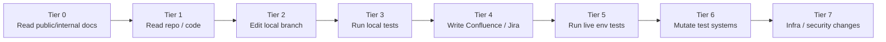
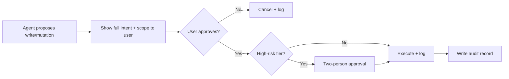

# 🔧 MCP Catalog & Governance

A proposed allowlist of Model Context Protocol (MCP) tools, with default access modes, risk levels, and approval gates.

> *This is a recommended catalog, not an approval. Each tool needs its own security/IAM review before enablement.*

---

## Governance tiers

| Tier | Default policy | Notes |
|---|---|---|
| **0** Read public/internal docs | broadly allowed | Connector-trimmed retrieval |
| **1** Read repo / code | broadly allowed | Local file / git read |
| **2** Edit local branch | broadly allowed | Local-only; never auto-push |
| **3** Run local tests | broadly allowed | Sandboxed runners |
| **4** Write Confluence / Jira | **gated + audited** | Approval workflow per change |
| **5** Run live-env tests | **gated + audited** | Test envs only, never prod by default |
| **6** Mutate test systems | **gated + audited + flagged** | Explicit per-call approval |
| **7** Infra / security changes | **highest gate** | Two-person + audit + change record |

**Read tools may be broadly allowed. Write tools need approval. Mutation tools need explicit flags and audit. Secrets must never be exposed to agents.**

---

## Recommended catalog

| Tool | Purpose | Default mode | Risk | R / W / M | Approval needed | Example use | Forbidden use |
|---|---|---|---|---|---|---|---|
| **Azure MCP** | Inspect Azure resources, services, configuration | read-only | medium | R | tier 1–3 self-serve, write gated | "What's the state of resource group X?" | Mutating prod resources without change record |
| **Bitbucket / Git MCP** | Source search, branch/PR context | read-only | low | R + write-on-PR | tier 2 self-serve | "Find usages of `SrsAlertHandler`" | Pushing to default branch unattended |
| **Jira MCP / API** | Issue search, traceability lookup | read-only | low–medium | R, W gated | write requires approval | "List open SRS-FDPS bugs" | Bulk-closing tickets without owner |
| **Confluence MCP / Atlassian Rovo MCP** | Search/update space content | read-only | low–medium | R, W gated | write requires approval | "Find ICD for SRS-FDPS interface" | Editing official ICD without owner sign-off |
| **Playwright MCP** | Browser exploration, UI automation | gated | medium | R + interactive | per-session approval | UI exploration on a test env | Automating a production user flow |
| **Read-only DB MCP** | Query approved views | read-only | medium–high | R | view allowlist | "What was the last status code returned?" | Querying base tables, joining PII |
| **CI / CD MCP** | Pipeline status, artifacts | read-only | medium | R, rerun gated | rerun requires approval | "Why did the last build fail?" | Triggering deploys without approval |
| **Observability / Logs MCP** | Logs, metrics, traces | read-only | medium | R | tier 1 self-serve | "Show error rate spike timeline" | Bulk-exporting logs containing PII |
| **Work IQ MCP** | M365 context (Teams, meetings, mail, docs) | permission-trimmed | medium | R | platform-approved | "Where was the SRS retest decision discussed?" | Summarizing a meeting the user wasn't in |
| **Team RAG MCP** | Team Azure AI Search index access | permission-trimmed | medium | R | per-team approval | "Find SRS testability notes for ack flow" | Returning chunks the user can't access |
| **Active mutation tools** *(message injectors, test data writers)* | Event simulation, fixture seeding | high-risk gated | high | M | explicit per-call approval + audit | Injecting a synthetic event in a sandbox env | Any production injection |

---

## Default mode definitions

- **Read-only** — tool exposes only retrieval/inspection methods.
- **Permission-trimmed** — read-only with ACL filtering before content reaches the model.
- **Gated** — tool is available, but each call requires explicit approval (in chat or via a workflow).
- **High-risk gated** — gated + audit logged + flagged in transcripts + reversible-test-env-only by default.

---

## Approval workflow (write / mutation)

The agent **never** auto-elevates. Approval applies only to the specific call that was approved.

---

## Audit expectations

- Every tool call above tier 3 logged with: actor, agent, tool, parameters (redacted), result digest, timestamp.
- Every mutating call additionally logged with: approval reference, scope, before/after digest where reversible.
- Logs retained per the platform team's retention policy.
- Dashboards: tool usage by team, write/mutation rate, approval-denied rate.

---

## What never gets exposed to agents

- Secrets, credentials, API keys, tokens.
- Private keys, certificates, vault contents.
- Unmasked production PII or operational data classified L3+.
- Other users' personal mailboxes, message histories, or files outside their scope.
- Production deployment, scaling, or infrastructure mutation tools by default.

---

## How a team adopts the catalog

1. Choose tools from the catalog using [`templates/team-onboarding/tools-policy.yml`](../templates/team-onboarding/tools-policy.yml).
2. Submit the policy for security review.
3. Start with all tools in **read-only**.
4. Run a 2-week observation window — review audit logs.
5. Propose a write/mutation upgrade only if the team has a real workflow that needs it.
6. Document the approval chain for every gated tool in the team's runbook.

---

## References

- [Azure MCP Server overview](https://learn.microsoft.com/en-us/azure/developer/azure-mcp-server/overview)
- [Atlassian Rovo MCP — authentication & authorization](https://support.atlassian.com/rovo/docs/authentication-and-authorization/)
- [Atlassian Remote MCP Server — getting started](https://support.atlassian.com/atlassian-rovo-mcp-server/docs/getting-started-with-the-atlassian-remote-mcp-server/)
- [Microsoft Work IQ overview](https://learn.microsoft.com/en-us/microsoft-365/copilot/extensibility/workiq-overview)
