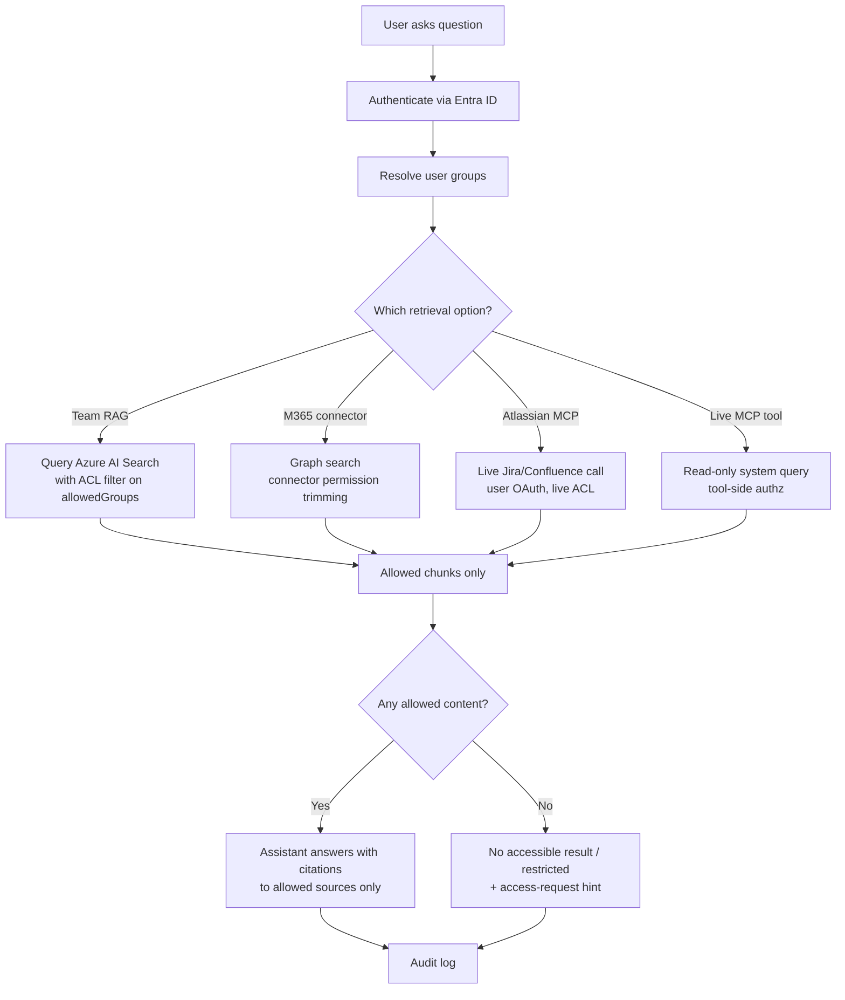

# 🛡️ Permission Model

How an AI-assisted engineering platform stops users from one team seeing another team's restricted documents — and how the assistant is prevented from leaking content the user can't access.

> *This is a recommended pattern. Real ACL design must be reviewed and approved by platform/security/IAM teams before rollout.*

---

## The non-negotiables

The assistant must:

1. **Authenticate** the user (Entra ID).
2. **Resolve groups** for that user.
3. **Filter at retrieval time** — ACL filter applied **before** chunks reach the model.
4. **Never** summarize or paraphrase content the user wasn't allowed to see.
5. **Audit** what was retrieved and what was returned.

The assistant must **not**:

- See chunks the user can't access.
- Be allowed to "guess around" missing chunks by stitching from training data.
- Reveal the existence of restricted content beyond the agreed metadata policy.

---

## The five layers of access control

Different sources enforce access in different places. A robust platform combines them:

| Layer | Where it lives | What it controls | Example |
|---|---|---|---|
| **1. Entra ID groups** | Identity provider | Who is in which group | `SRS-Engineering`, `SRS-QA`, `SRS-Architecture`, `OTHER-TEAM` |
| **2. Source ACL** | The originating system (Confluence space, SharePoint site, Jira project, file share) | Whether the user has access to the source object at all | A Confluence space restricted to SRS members |
| **3. Atlassian permission trimming** | Atlassian Rovo / Remote MCP | Live, per-call: the user's own Atlassian permissions are honored | A non-SRS user querying via Atlassian MCP gets no SRS-restricted pages |
| **4. M365 connector permission trimming** | Microsoft Graph / connector behavior | Synced and federated connectors honor source ACLs | An out-of-team user gets nothing back from a Graph search over a restricted source |
| **5. Azure AI Search ACL / security filter** | The team RAG index | Each chunk carries `allowedGroups`; the query filter restricts results to chunks intersecting the user's groups | A chunk with `allowedGroups: [SRS-Architecture]` is invisible to a `SRS-QA`-only member |

**Layered defense:** even if one layer fails, the next one catches it. A user's Entra group entitlement is meaningless if the chunk's ACL doesn't grant them, the source itself is permissioned, and the connector trimming respects that.

---

## End-to-end flow



The model **never** sees a chunk the user is not allowed to see — filtering happens before retrieval reaches the model.

---

## Classification model

Every source and every chunk gets a sensitivity level:

| Level | Name | Examples | Default AI access | Recommended retrieval |
|---|---|---|---|---|
| **L0** | General internal | Coding standards, onboarding docs, broad org policies | Broad internal | Synced connector |
| **L1** | Team internal | Team design notes, internal roadmaps | Team members | Team RAG with team ACL |
| **L2** | Restricted technical | Interface specs (ICDs), environment docs, restricted architecture | Approved engineering groups | Team RAG with strict ACL **or** federated retrieval |
| **L3** | Sensitive / security-risk | Threat models, vulnerability details, restricted safety analyses | Case-by-case, named groups | Federated retrieval only, minimum-summary policy |
| **L4** | Secret / regulated | Credentials, classified ops data, legally regulated content | **No AI access by default** | Approved secure process only — never indexed |

**The rule:** the higher the level, the less the document should be copied.

---

## What happens when nothing is allowed

If the ACL filter drops every candidate chunk:

1. The assistant **does not** retry without the filter.
2. The assistant **does not** answer from training data as if it had retrieved.
3. The assistant returns a clear message: *"No accessible result for your access level. If you believe you should have access, request membership in `<group>` via the standard IAM workflow."*
4. The audit log records: query, user, group set, source set queried, hit count = 0.

The "no accessible result" message **must not** disclose:

- The titles of the restricted docs.
- The number of restricted docs that exist.
- The owner group of restricted content beyond what policy allows.

If revealing even the existence of restricted content is a concern, return only a generic "no result" — not "no *accessible* result".

---

## Access requests — how they should work

When a user hits a wall, the assistant offers a **path**, not a workaround:

```mermaid
flowchart LR
    A[Assistant: no accessible result] --> B[Show recommended group(s) to request]
    B --> C[Link to IAM access-request workflow]
    C --> D[User submits request via normal IAM tool]
    D --> E[Group owner reviews]
    E --> F[Approval -> next ACL refresh]
    F --> G[User retries query, now succeeds]
```

What the assistant **does not** do:

- ❌ Open the access request itself.
- ❌ Bypass the request by retrieving via a different tool.
- ❌ Summarize what the user *would* see if they had access.

The assistant's job is to surface the **path**, not the **content**.

---

## What must never happen

These are non-negotiable platform rules:

- ❌ The assistant retrieves chunks without applying the ACL filter.
- ❌ The assistant summarizes a document the user lacks access to.
- ❌ The assistant copies a restricted (L3+) chunk into a lower-classification store (repo memory, Confluence page, Jira comment).
- ❌ The assistant uses a more-privileged tool to "get around" a permission denial.
- ❌ The assistant infers restricted content from training data when retrieval failed.
- ❌ Synced connectors are configured for L3+ sources.
- ❌ L4 content is exposed to AI assistants by default — ever.
- ❌ The assistant logs the *content* of restricted chunks; only the metadata required for audit.

---

## Worked example — SRS (the example team)

Three users ask the same question:

> *"How does the SRS subsystem send acknowledgement messages to its peer system?"*

| User | Entra groups | Layer that applies | What they see | What they don't see |
|---|---|---|---|---|
| **SRS-QA member** | `ALL-MUAC`, `SRS-Engineering`, `SRS-QA` | Team RAG ACL filter on `allowedGroups` | Public SRS overview · testability notes · L1/L2 ICD chunks where `allowedGroups` includes `SRS-QA` | Architecture-only restricted ICD chunks · security risk analysis |
| **SRS-Architecture member** | `ALL-MUAC`, `SRS-Engineering`, `SRS-Architecture` | Team RAG ACL filter | Public SRS overview · architecture-restricted ICD chunks · L1/L2 testability notes | Security risk analysis (L3, separate group) |
| **OTHER-TEAM developer** | `ALL-MUAC`, `OTHER-Engineering` | Team RAG ACL filter drops all SRS-restricted chunks; only L0/general content survives | Public SRS overview only — *or* "no accessible result" depending on policy | All SRS-internal, restricted, and sensitive content |

The assistant **never** sees the chunks the ACL filter dropped, so it cannot leak them by paraphrase, summary, or "best guess".

For the runnable conceptual demo of this exact behavior, see [`examples/local-permission-demo/`](../examples/local-permission-demo/).

---

## Pre-launch permission checklist

Before any team goes live with Team RAG:

- [ ] Every source has a sensitivity classification (L0–L4).
- [ ] Every chunk in the index has an `allowedGroups` field.
- [ ] At least one **negative** golden question exists (verifies a non-member is denied).
- [ ] At least one **L3** golden question exists (verifies federated-only behavior).
- [ ] Audit logging is enabled for all retrieval calls above the agreed risk threshold.
- [ ] The "no accessible result" message has been reviewed by platform/security.
- [ ] The access-request workflow is linked from that message.
- [ ] L4 content is verified to be **excluded** from the index.
- [ ] An ACL refresh schedule is in place for group membership changes.

See the SRS golden questions ([`examples/srs-team-rag/srs-golden-questions.yml`](../examples/srs-team-rag/srs-golden-questions.yml)) for permission-edge-case examples.

---

## Related pages

- [Connectors & RAG options](connectors-and-rag-options.md) — which retrieval option each layer enforces
- [Team RAG framework](team-rag-framework.md) — the full Team RAG build pattern (where the ACL filter is applied)
- [MCP catalog](mcp-catalog.md) — per-tool default modes and approval gates
- [Tool policy](tool-policy.md) — the reusable tool policy a repo can copy
- [Local permission demo](../examples/local-permission-demo/) — conceptual demo of permission trimming
