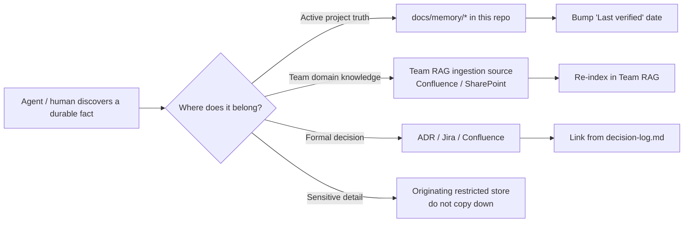

# 📁 Project Memory Pattern

Every engineering repo should hold its **active working truth** in a small, predictable structure. Project memory is *not* a copy of company or team RAG — it is the in-flight, repo-specific knowledge that the assistant needs to be useful right now.

---

## What project memory is — and is not

| ✅ Project memory is | ❌ Project memory is not |
|---|---|
| The current implementation state | A copy of all company docs |
| Active blockers and constraints | A replacement for Confluence / SharePoint |
| Last verified facts and dates | A backup of meeting notes |
| Traceability + decision links | A vault for restricted documents |
| Run commands + tool policy | A place to paste credentials or secrets |
| Pointers to authoritative sources | The authoritative source itself |

**Rule:** if a fact already lives in Confluence, SharePoint, Jira, or Team RAG, *link to it*. Don't copy it.

---

## Recommended repo structure

```text
repo/
├── README.md
├── .github/
│   ├── copilot-instructions.md
│   ├── prompts/
│   └── agents/
├── .claude/
│   ├── agents/
│   ├── skills/
│   └── commands/
├── docs/
│   ├── memory/
│   │   ├── README.md
│   │   ├── source-map.md
│   │   ├── feature-index.md
│   │   ├── requirement-index.md
│   │   ├── route-map.md
│   │   ├── blocker-index.md
│   │   └── decision-log.md
│   ├── tool-policy.md
│   └── external-knowledge.md
└── …
```

---

## File-by-file purpose

### `docs/memory/README.md`
Index page. Explains what each memory file is for, who maintains it, and the write-back rule.

### `docs/memory/source-map.md`
Map of where things live in the codebase: entry points, key services, important modules, "the file you'll usually need first".

### `docs/memory/feature-index.md`
List of features the repo implements with their current status, owning module, and primary tests.

### `docs/memory/requirement-index.md`
Traceability between external requirement IDs and the code/tests that implement them. Links out to Team RAG / Jira for the requirement source.

### `docs/memory/route-map.md`
For UI/API repos: the map of routes/endpoints, who they serve, and how they're tested.

### `docs/memory/blocker-index.md`
Active blockers, why they block, owner, and link to the issue that tracks resolution.

### `docs/memory/decision-log.md`
Lightweight ADR-style log: decision, date, why, what we tried, what we rejected, link to durable record (ADR or Confluence) if applicable.

### `docs/tool-policy.md`
Which MCP tools the repo's agents may use, at which tier, with which approval expectations. References [`docs/mcp-catalog.md`](mcp-catalog.md).

### `docs/external-knowledge.md`
The map: *"What lives where?"* — Team RAG topics, Confluence spaces, Work IQ scope, Jira projects, and how the assistant should choose between them.

---

## The write-back loop



**Rule of thumb:** if you learned it once and you'll need it next sprint, write it back. If you learned it once and it's a one-off, don't.

---

## Examples per repo type

### QA repo

```text
docs/memory/
├── source-map.md          # which test packs map to which features
├── feature-index.md       # feature → primary test pack
├── route-map.md           # UI routes covered / not covered
├── selector-index.md      # stable selectors per page/component
├── blocker-index.md       # flaky tests with root-cause links
└── decision-log.md        # "we mock the alert feed because…"
```

### Service / backend repo

```text
docs/memory/
├── source-map.md          # services, handlers, key modules
├── feature-index.md       # endpoints / message types
├── requirement-index.md   # SRS_REQ_xxx → handler → test
├── blocker-index.md       # known production constraints
└── decision-log.md        # "we chose async over sync because…"
```

### DB / data repo

```text
docs/memory/
├── source-map.md          # schemas, owners, sensitivity per table
├── feature-index.md       # data products / pipelines
├── requirement-index.md   # data contracts → owner
├── blocker-index.md       # schema changes pending review
└── decision-log.md        # "PII tables stay in restricted views"
```

### Infrastructure repo

```text
docs/memory/
├── source-map.md          # modules, environments, ownership
├── feature-index.md       # deployable units, scaling profile
├── route-map.md           # network paths, ingress/egress
├── blocker-index.md       # capacity / quota issues
└── decision-log.md        # "we use private endpoints because…"
```

---

## Minimum viable project memory

If a team can only do one thing:

1. Create `docs/memory/README.md` with one paragraph per intended file.
2. Create `docs/memory/decision-log.md` and start writing decisions as they happen.
3. Create `docs/external-knowledge.md` listing Team RAG topics + Confluence/Jira links the assistant should know about.

Everything else can grow organically as the team adopts AI-assisted workflows.

---

## What goes in each entry

A good project-memory entry is a 5–15 line markdown block:

```markdown
### Feature: SRS alert acknowledgement

- Status: implemented, partial test coverage
- Primary module: `src/srs/alerts/`
- Tests: `tests/srs/alerts/*.spec.ts`
- Linked requirement: SRS_ALERT_042 (see Team RAG)
- Last verified: 2026-04-30
- Notes: ack flow uses async writer; see decision-log.md#async-ack
```

Short, dated, linked. No prose essays.

---

## What never goes here

- ❌ Credentials, API keys, secrets
- ❌ Production data / PII
- ❌ Restricted-classification documents (L3+)
- ❌ Mirrors of authoritative docs that already live in Confluence
- ❌ "Just in case" content that nobody actually queries

If the file isn't being read, delete it.
