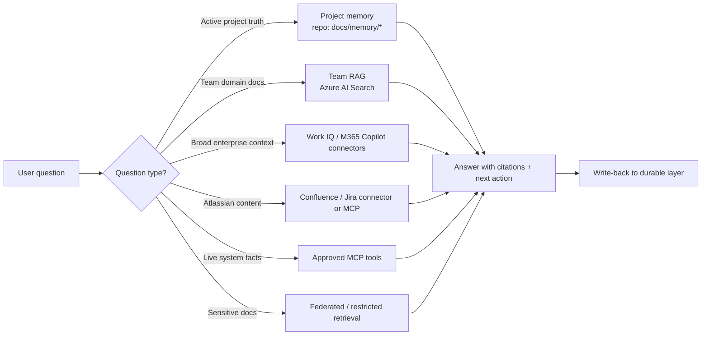
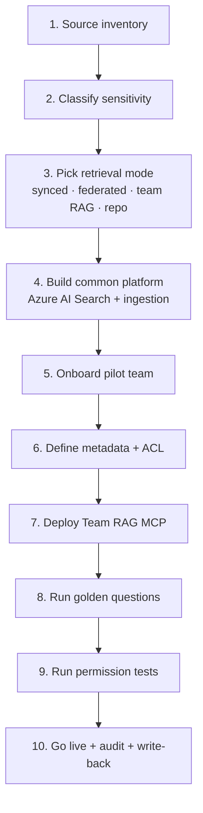
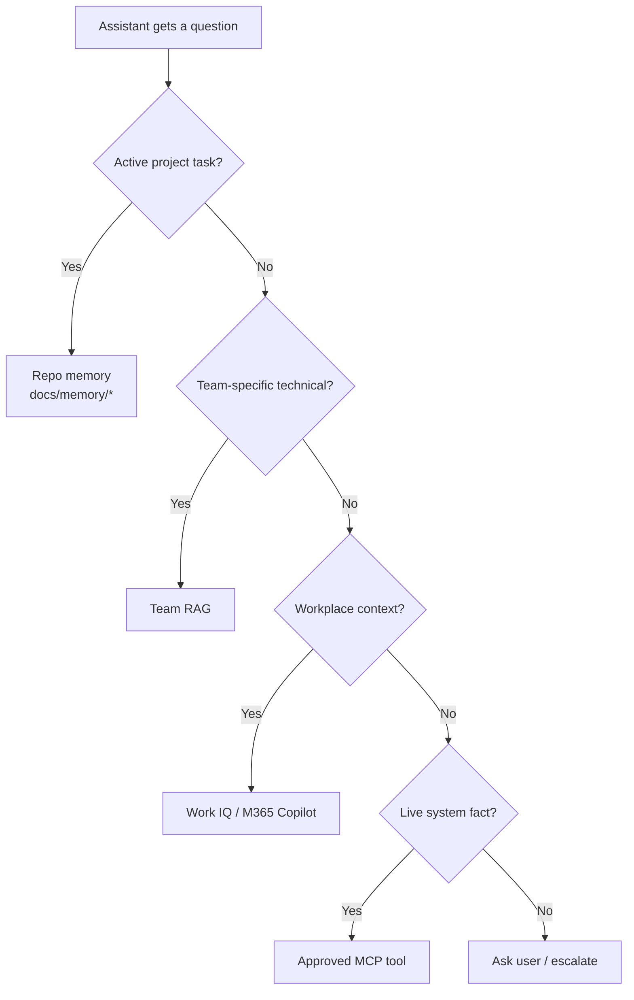

# 🧬 Team RAG Implementation Framework

A practical, vendor-aware pattern for standing up team-scoped retrieval-augmented generation alongside enterprise context, project memory, and governed tools.

---

## The four retrieval layers



| Layer | Stores | Best storage / tooling | Reach |
|---|---|---|---|
| **A. Company memory** | Confluence, SharePoint, Teams, Jira, M365 Docs, policies | M365 Copilot connectors, Microsoft Graph, Work IQ | M365 Copilot, Work IQ MCP |
| **B. Team memory** | Team-specific docs, ICDs, architecture, testability notes | Azure AI Search index | Team RAG MCP / Foundry agent |
| **C. Project memory** | Active implementation truth (coverage, blockers, decisions, selectors) | Markdown in repo (`docs/memory/*`) | Direct file read |
| **D. Live system context** | Logs, DB rows, CI status, Azure resource state | Source systems, no copy | Approved read-only MCP tools |

**Rule of thumb:** *Company docs stay in enterprise systems. Team knowledge gets indexed securely. Project truth lives in the repo. Live systems are queried, not indexed.*

---

## Step-by-step team RAG build



### Step 1 — Source inventory

For every team, capture:

| Question | Example |
|---|---|
| Team name | SRS |
| Systems owned | SRS, SRS HMI, SRS gateway |
| Where docs live | Confluence, SharePoint, Bitbucket, Jira |
| Authoritative docs | SSS, ICDs, architecture, runbooks |
| Sensitive docs | Security design, interface details |
| Allowed groups | SRS-Engineering, SRS-QA, SRS-Safety |
| Common questions | Testability, interface lookup, requirement mapping |
| Required tools | Jira, Bitbucket, Playwright, read-only logs |
| Owners | System owner, document owner, security owner |

Template: [`templates/team-onboarding/team-source-inventory.yml`](../templates/team-onboarding/team-source-inventory.yml).

### Step 2 — Classify every source

| Source type | Example | Recommended retrieval |
|---|---|---|
| Broad enterprise docs | General Confluence, SharePoint, Jira | M365 Copilot **synced** connectors |
| Sensitive / dynamic / regulated | Security-risk docs, live status | M365 **federated** connector or live MCP |
| Team technical corpus | ICDs, architecture, interface specs | Team RAG index in Azure AI Search |
| Active project truth | Coverage, blockers, decisions, selectors | Repo memory in Git |
| Live systems | DB, logs, Azure, CI, brokers | Governed MCP tools — *not* RAG |

### Step 3 — Synced vs federated retrieval

| Connector model | Data movement | Best for |
|---|---|---|
| **Synced** | Indexed into Microsoft Graph | Broad, stable enterprise docs |
| **Federated** | Stays in source, fetched live via MCP-style call | Sensitive, dynamic, or regulated content |

### Step 4 — Build a common Azure AI Search platform

The platform team provides **once**:
- Azure AI Search index template
- Ingestion pipeline (chunking, embedding, metadata extraction, ACL stamping)
- Reusable Team RAG MCP server

Each team plugs in **its own**:
- Sources
- Metadata values
- Allowed groups
- Golden questions

### Step 5 — Onboard a pilot team

Use the SRS example in [`examples/srs-team-rag/`](../examples/srs-team-rag/) as a walk-through.

### Step 6 — Define metadata and ACL

Required metadata fields ([`templates/team-onboarding/metadata-schema.yml`](../templates/team-onboarding/metadata-schema.yml)):

```yaml
team
system
sourceSystem
sourceUrl
docTitle
docType
classification          # L0 / L1 / L2 / L3 / L4
ownerGroup
allowedGroups           # Entra group names
lastIndexed
```

Optional fields:

```yaml
requirementId
feature
interface
testLane
safetyImpact
component
serviceName
release
```

Example chunk:

```json
{
  "team": "SRS",
  "system": "SRS",
  "sourceSystem": "Confluence",
  "sourceUrl": "https://confluence.example/pages/12345",
  "docTitle": "SRS Interface Control Document",
  "docType": "ICD",
  "classification": "L2-restricted",
  "interface": "SRS-FDPS",
  "requirementId": "SRS_ALERT_042",
  "ownerGroup": "SRS-Architecture",
  "allowedGroups": ["SRS-Engineering", "SRS-QA", "SRS-Safety"],
  "lastIndexed": "2026-04-30"
}
```

### Step 7 — Deploy a Team RAG MCP

A **Team RAG MCP server** is the controlled bridge between the assistant and Azure AI Search. It exposes safe tools such as:

```text
search_team_docs(query, filters)
get_doc_summary(sourceUrl)
find_requirement(requirementId)
find_interface(interfaceName)
find_testability_notes(feature)
find_owner(systemOrDoc)
```

It must:

1. authenticate the user (Entra ID),
2. resolve groups,
3. query Azure AI Search **with permission filters**,
4. return only allowed chunks (with citations),
5. log access for audit,
6. never reveal restricted content metadata if policy disallows it.

### Step 8 — Permission / security trimming

```mermaid
flowchart TD
    A[User asks question] --> B[Authenticate with Entra ID]
    B --> C[Resolve user groups]
    C --> D[Run search with ACL filter]
    D --> E{Document ACL allows user?}
    E -->|Yes| F[Return chunk + citation]
    E -->|No| G[Drop chunk silently]
    F --> H[Assistant answers using allowed sources]
    G --> I[If no allowed content remains: "no accessible result"]
```

The model **never** receives chunks the user is not allowed to see.

### Step 9 — Golden questions

Maintain a per-team set:

- **retrieval correctness** — does it find the right doc?
- **citation quality** — are sources linked?
- **permission tests** — does an out-of-team user *not* receive restricted content?
- **edge cases** — ambiguous interface names, multiple matching ICDs, deprecated docs.

Template: [`templates/team-onboarding/golden-questions.yml`](../templates/team-onboarding/golden-questions.yml).

### Step 10 — Sync jobs

- Nightly incremental ingest from each source.
- Full re-index on schema or ACL change.
- Removed-doc handling (don't keep ghost chunks).
- Metric: time-to-freshness per source.

### Step 11 — Write-back

When the assistant produces a durable finding:

| Finding | Goes to |
|---|---|
| Project-specific test decision | Repo memory (`docs/memory/decision-log.md`) |
| Team-level interface summary | Team RAG ingestion source (Confluence / SharePoint) |
| Formal blocker or decision | Jira / Confluence / ADR |
| Sensitive detail | Stays in originating restricted source — *do not* copy to lower-classification layer |

---

## When to use what



| Use… | When |
|---|---|
| **Project memory** | Question is about the current repo's behavior, coverage, blockers, or decisions |
| **Team RAG** | Question needs domain-specific docs (ICDs, architecture, testability) |
| **Work IQ / M365 Copilot** | Question is about meetings, decisions, ownership, recent context |
| **MCP tools** | Question requires a live fact (log, DB row, pipeline status) |

---

## What about "DB RAG"?

Indexing schema/metadata is fine. Indexing rows is not.

✅ Index:
- Schema docs, ERDs, table/column descriptions
- Data catalog entries, ownership, lineage
- Migration docs, approved sample queries
- Privacy/sensitivity labels

❌ Don't index:
- Production rows
- Credentials, secrets, personal data
- Sensitive operational data
- Unrestricted copies of tables

For live facts, use a **read-only DB MCP** that queries approved views, not the underlying tables.

---

## What needs platform / Microsoft / partner help vs internal

| Activity | Internal | External help useful |
|---|---|---|
| Team / source inventory | ✅ | — |
| Metadata schema | ✅ | optional |
| Repo memory pattern | ✅ | — |
| Azure AI Search pilot | ✅ | optional |
| Team RAG MCP prototype | ✅ | optional |
| M365 connector enterprise rollout | possible | recommended |
| Work IQ approval / config | possible | recommended |
| Purview / sensitivity-label integration | possible | recommended |
| Entra group / ACL architecture | ✅ | recommended |
| MCP catalog security review | ✅ | recommended |
| Production governance / audit | ✅ | recommended |

---

## References

- [Microsoft 365 Copilot connectors overview](https://learn.microsoft.com/en-us/microsoftsearch/connectors-overview)
- [Microsoft Work IQ overview](https://learn.microsoft.com/en-us/microsoft-365/copilot/extensibility/workiq-overview)
- [Azure AI Search document-level access control](https://learn.microsoft.com/en-us/azure/search/search-document-level-access-overview)
- [Azure AI Foundry file search](https://learn.microsoft.com/en-us/azure/ai-foundry/agents/how-to/tools/file-search)
- [Azure MCP Server overview](https://learn.microsoft.com/en-us/azure/developer/azure-mcp-server/overview)
