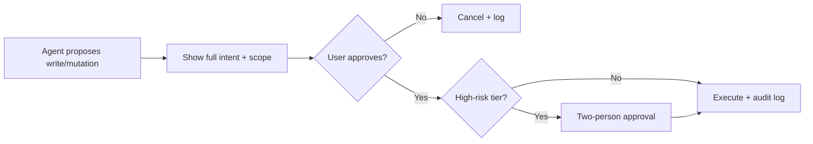

# 🧰 Tool Policy

A reusable tool policy any repo can copy into `docs/tool-policy.md`. It declares which MCP tools the repo's agents may use, at which mode, with which approval expectations.

> *This is a recommended starter policy. Each repo customizes it based on the team's MCP allowlist and the agreed central catalog ([`docs/mcp-catalog.md`](mcp-catalog.md)).*

---

## Core principles

1. **Read-only first.** Every tool starts read-only. Mutation is a separate, gated step.
2. **Write tools require approval.** Approval applies only to the specific call that was approved.
3. **Mutation tools require explicit gates and audit.** Including a per-call flag, an approval reference, and an audit record.
4. **No secrets.** Credentials, tokens, and API keys are never exposed to agents.
5. **No production mutation by default.** Production-affecting tools are off unless explicitly enabled.
6. **No cross-permission summarization.** The assistant never summarizes content the user can't access.
7. **No copying restricted docs into lower-classification repos.** L3+ content stays in its originating store.

---

## Allowed tools by risk tier

The tier model mirrors [`docs/mcp-catalog.md`](mcp-catalog.md):

| Tier | Default policy in this repo | What that means |
|---|---|---|
| **0** Read public / internal docs | Allowed | Connector-trimmed retrieval |
| **1** Read repo / code | Allowed | Local file / git read |
| **2** Edit local branch | Allowed | Local-only; never auto-push |
| **3** Run local tests | Allowed | Sandboxed runners |
| **4** Write Confluence / Jira | **Gated + audited** | Approval workflow per change |
| **5** Run live-env tests | **Gated + audited** | Test envs only; never production by default |
| **6** Mutate test systems | **Gated + audited + flagged** | Explicit per-call approval |
| **7** Infra / security changes | **Highest gate** | Two-person + audit + change record |

---

## Default mode definitions

- **Read-only** — tool exposes only retrieval/inspection methods.
- **Permission-trimmed** — read-only with ACL filtering before content reaches the model.
- **Gated** — tool is available, but each call requires explicit approval (in chat or via a workflow).
- **High-risk gated** — gated **+** audit logged **+** flagged in transcripts **+** test-env-only by default.

---

## Approval flow

The agent **never** auto-elevates a tool's mode. Approval is per-call, not per-session.

---

## Example flags

These are **example** flags a repo can use to make per-call approvals explicit. They are not required implementation — adopt the names that fit the repo's runtime. The intent is: **mutation never happens on a default code path**.

| Flag | Meaning | Default |
|---|---|---|
| `AI_LIVE_TEST=1` | Allow tier-5 calls (live-env tests on a test environment) | unset |
| `AI_WRITE_CONFLUENCE=1` | Allow tier-4 Confluence writes for this approval window | unset |
| `AI_DB_READONLY=1` | Confirm DB MCP is in read-only mode for this session | enforced default |
| `AI_MUTATION_APPROVED=1` | Allow a single tier-6 mutation call | unset |

A flag does **not** replace the chat-level approval — it just makes the approval visible to the runtime so the tool actually executes.

---

## Per-tool policy template

A repo's `docs/tool-policy.md` should contain one row per tool the repo's agents are allowed to use. Use the central catalog as the source list ([`docs/mcp-catalog.md`](mcp-catalog.md)) and the team policy template as the editable form ([`templates/team-onboarding/tools-policy.yml`](../templates/team-onboarding/tools-policy.yml)).

| Tool | Enabled? | Default mode | Approver | Notes |
|---|---|---|---|---|
| Bitbucket / Git MCP | yes | read-only | <approver> | Source search, PR context |
| Jira MCP | yes | read-only | <approver> | Writes via tier-4 approval |
| Confluence MCP / Atlassian Rovo MCP | yes | read-only | <approver> | Writes via tier-4 approval |
| Team RAG MCP | yes | permission-trimmed | <approver> | ACL filter on every query |
| CI / CD MCP | yes | read-only | <approver> | Reruns gated |
| Observability / Logs MCP | yes | read-only | <approver> | No PII export |
| Read-only DB MCP | optional | read-only against approved views | <approver> | Explicit view allowlist |
| Playwright MCP | optional | gated | <approver> | Test env only |
| Azure MCP | optional | read-only | <approver> | Mutating ops gated |
| Work IQ MCP | optional | permission-trimmed | <approver> | Once approved by platform team |
| Active mutation tools | off by default | high-risk gated | <approver> | Test environments only |

---

## Hard rules

These rules apply to every tool in the policy, regardless of mode:

- ✅ Read tools are broadly available within the team's allowlist.
- ✅ Write tools require explicit approval. One-off approval applies only to that call.
- ✅ Mutation tools require explicit flag, approval, and audit log.
- ❌ Secrets, credentials, and L4 content are **never** exposed to agents.
- ❌ The agent **never** auto-elevates a tool's mode.
- ❌ The agent **never** installs or registers a new MCP server itself.
- ❌ The agent **never** copies restricted (L3+) content into a lower-classification store.
- ❌ The agent **never** summarizes content the user can't access.
- ❌ The agent **never** runs production mutations by default.

---

## Audit expectations

| Tier | Logged? | Extra log fields |
|---|---|---|
| 0–3 | Sampled | actor, agent, tool, parameters digest |
| 4 | Always | + approval reference, scope |
| 5 | Always | + environment, before/after digest |
| 6 | Always | + flag value, approval reference, scope, before/after |
| 7 | Always | + two-person approval references, change record link |

Logs follow the platform team's retention policy. Dashboards: tool usage by team, write/mutation rate, approval-denied rate.

---

## How a repo adopts this policy

1. Copy this page into `docs/tool-policy.md` of the repo.
2. Replace the per-tool table with the team's actual allowlist (from [`templates/team-onboarding/tools-policy.yml`](../templates/team-onboarding/tools-policy.yml)).
3. Fill the **approver** column with named owners.
4. Verify the **example flags** match the repo's runtime conventions.
5. Submit the policy for security review before any tier-4+ tool is enabled.

---

## Related pages

- [MCP catalog](mcp-catalog.md) — the central tool catalog and tiers
- [Permission model](permission-model.md) — how ACL trimming applies to tool calls
- [Connectors & RAG options](connectors-and-rag-options.md) — RAG and live MCP differences
- [External knowledge map](external-knowledge.md) — how a repo declares which retrieval option per question type
- [Team onboarding tools-policy template](../templates/team-onboarding/tools-policy.yml) — editable YAML form
