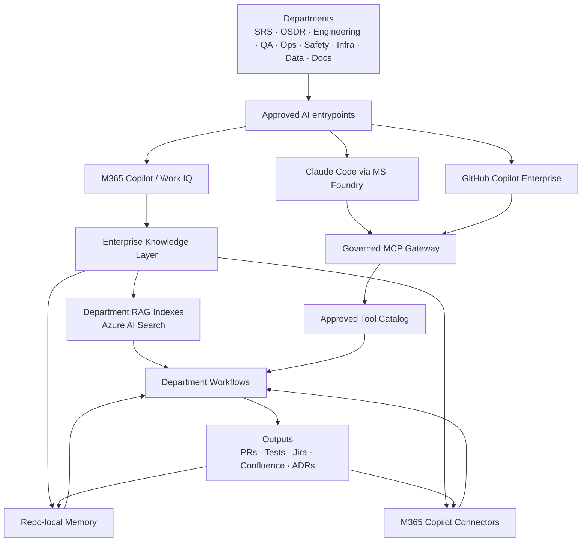
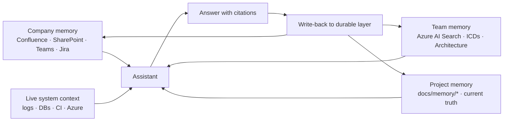
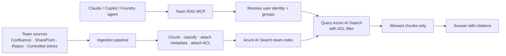
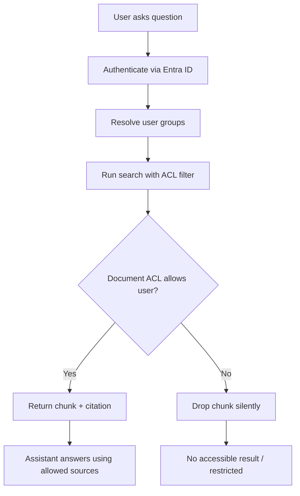
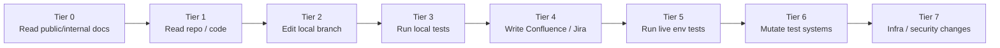
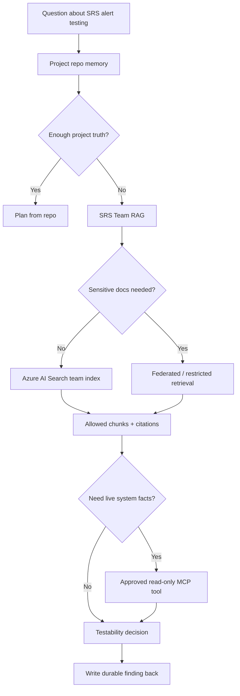
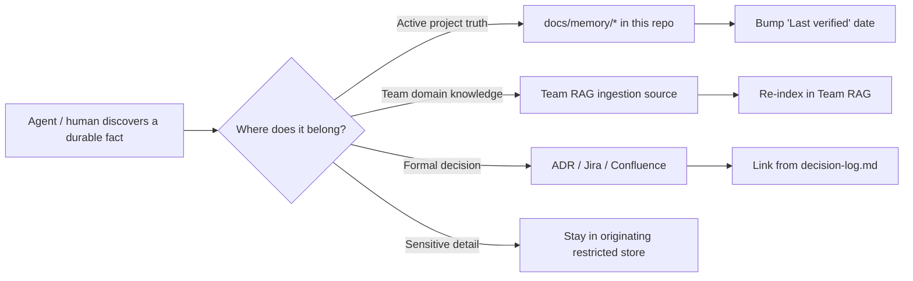
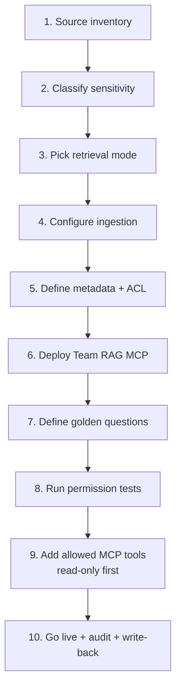
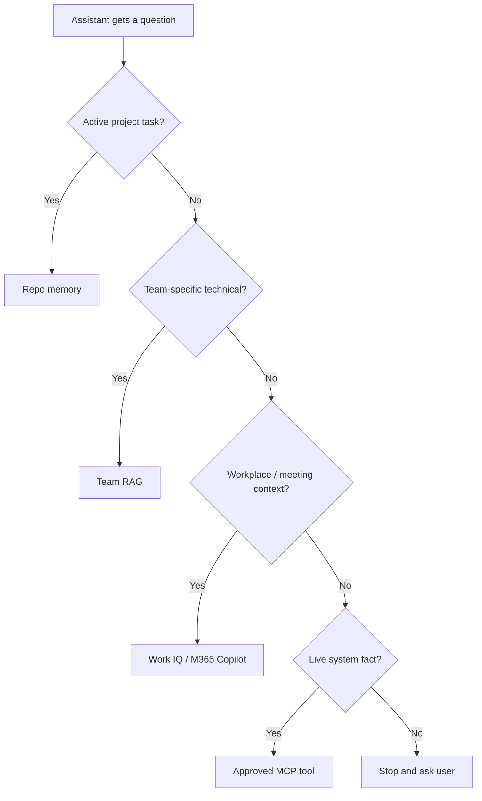
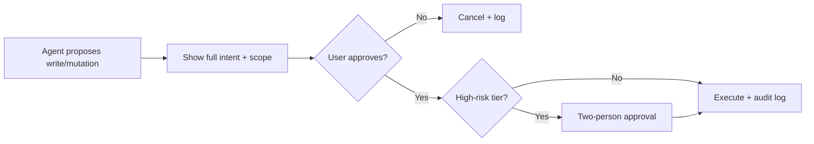

# 🎨 Visual Architecture Cheat Sheet

All the diagrams in one place. Each one is a single idea — copy any of them into a slide, a Confluence page, or a kickoff meeting.

---

## 1. Enterprise platform architecture

---

## 2. Memory hierarchy

---

## 3. Team RAG architecture

---

## 4. Permission / security trimming

---

## 5. MCP governance tiers

---

## 6. SRS example: query routing

---

## 7. Write-back loop

---

## 8. Team onboarding flow

---

## 9. Decision: which retrieval layer?

---

## 10. Approval gate (write / mutation)

