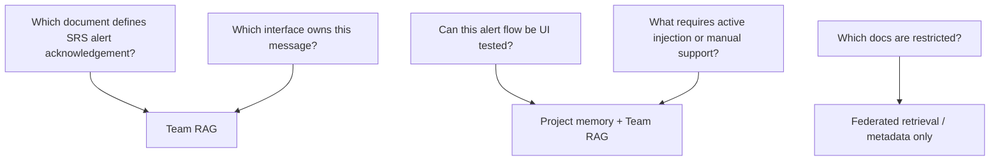
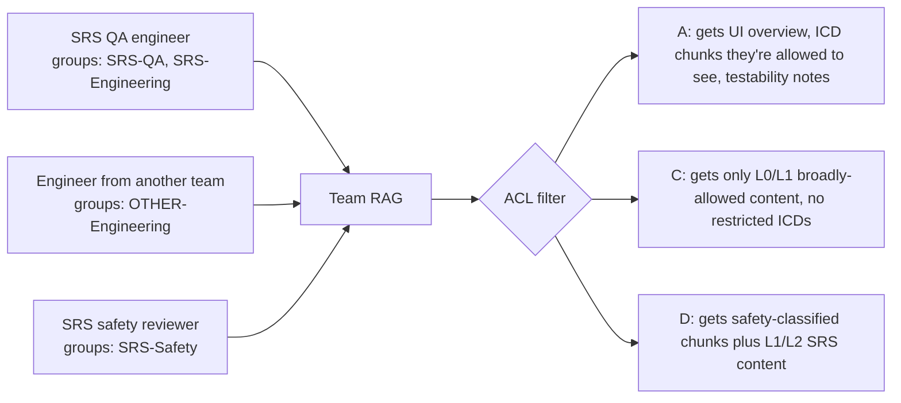

# 🛰️ SRS Team RAG — Worked Example

A walkthrough of how a fictional **SRS** team would adopt the framework. SRS here stands for *Surveillance Reception System* — the example domain used throughout this repo. Nothing in this folder represents a real deployed system.

> All names, paths, and identifiers are placeholders. There are no real internal URLs, secrets, or operational details.

---

## What's in this kit

| File | Purpose |
|---|---|
| [`srs-rag-config.yml`](srs-rag-config.yml) | A filled-in `team-rag-config.yml` for SRS |
| [`srs-metadata-examples.md`](srs-metadata-examples.md) | Example chunk metadata for typical SRS docs |
| [`srs-golden-questions.yml`](srs-golden-questions.yml) | Retrieval, citation, and permission tests |
| [`srs-agent-workflow.md`](srs-agent-workflow.md) | How an SRS engineer's question flows through the system |

---

## SRS at a glance

| Aspect | Value |
|---|---|
| Team | SRS Architecture + Engineering + QA + Safety |
| Systems owned | SRS, SRS HMI, SRS gateway |
| Authoritative docs | SSS, STD, ICDs, architecture diagrams, runbooks |
| Sensitive docs | Security risk analyses, restricted interface details |
| Allowed groups (example) | `SRS-Engineering`, `SRS-QA`, `SRS-Safety`, `SRS-Architecture` |
| Common questions | Testability of alert flows, message contracts, requirement traceability |

---

## Source map (illustrative)

| Source | Type | Sensitivity | Retrieval mode |
|---|---|---|---|
| SRS Confluence space | Confluence | L1 / L2 | Team RAG (Azure AI Search) |
| SRS SharePoint architecture docs | SharePoint | L2 | Team RAG with strict ACL |
| SRS Jira project | Jira | L1 | M365 connector + Atlassian MCP |
| SRS Bitbucket docs | Bitbucket | L1 | Team RAG (curated subset) |
| SRS interface specs (ICDs) | Confluence / SharePoint | L2 | Team RAG strict ACL |
| SRS security risk analyses | Restricted store | L3 | Federated retrieval only |

---

## Example questions (and where they should be answered from)

| Question | Best answered from |
|---|---|
| "Which document defines SRS alert acknowledgement?" | Team RAG (SRS Confluence + ICDs) |
| "Can this alert flow be UI tested?" | Project memory + Team RAG testability notes |
| "Which interface owns this message?" | Team RAG ICDs |
| "What requires active injection or manual support?" | Project memory (decision log) |
| "Which docs are restricted?" | Metadata-only via federated retrieval |

---

## Permission behavior (illustrative)

Three users ask: *"How does SRS send acknowledgement messages to another system?"*

| User | Sees | Doesn't see |
|---|---|---|
| `SRS-QA` member | UI overview, ICD chunks (allowed), testability notes | Security risk analysis |
| Out-of-team developer | UI overview only (or "no accessible result") | ICDs, testability notes, security risk analysis |
| `SRS-Safety` member | UI overview, ICDs (allowed), security risk analysis | — |

The assistant **never** summarizes restricted chunks it never received.

---

## How to use this kit

1. Copy this folder to your team's repo or shared workspace.
2. Replace SRS-specific names with your team's names.
3. Fill the source list with your real authoritative sources.
4. Define your Entra groups in `permissions.yml` ([template](../../templates/team-onboarding/permissions.yml)).
5. Run the golden questions ([`srs-golden-questions.yml`](srs-golden-questions.yml)) as your acceptance test.
6. See [`srs-agent-workflow.md`](srs-agent-workflow.md) for an end-to-end query trace.
