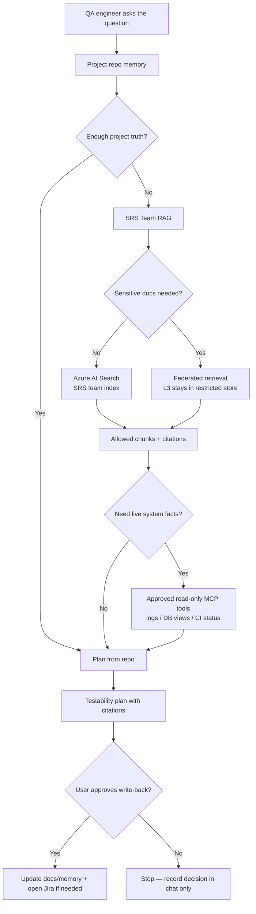

# SRS — End-to-End Agent Workflow

A worked example: an SRS QA engineer asks a real question, and the framework routes the work through the right layers.

---

## The question

> *"Can we safely automate testing for an SRS alert that receives live data, displays it on the HMI, and sends an acknowledgement to another system?"*

---

## How the framework handles it



---

## What the assistant should do step by step

### 1. Check project memory first

The assistant reads `docs/memory/feature-index.md`, `route-map.md`, and `decision-log.md`. It finds:

- Alert HMI page is already covered by a smoke test.
- Acknowledgement message contract is referenced but not test-covered.
- A prior decision noted that **active injection requires approval and a sandbox env**.

This is enough to know the question can't be fully answered from the repo alone.

### 2. Query the SRS Team RAG (permission-trimmed)

Through the **Team RAG MCP**:

```
search_team_docs(
  query="alert acknowledgement message contract testability",
  filters={ "team": "SRS" }
)
```

The MCP authenticates the user, resolves their Entra groups (`SRS-QA`, `SRS-Engineering`), and queries Azure AI Search **with ACL filtering**. The user is in those groups, so they receive:

- The SRS-FDPS ICD chunks (L2, allowed)
- The SRS testability note for ack flow (L1, allowed)

They do **not** receive:

- The SRS security risk analysis (L3, federated, restricted to `SRS-Safety`).

### 3. Optionally query Work IQ (if approved)

If the platform team has approved Work IQ for this team, the assistant might ask:

> "Was a decision made recently about SRS ack-flow testing?"

Work IQ surfaces a recent meeting note pointing to a Jira ticket about a sandbox environment for active injection. This is **context**, not authoritative — it links back to the durable Jira/Confluence record.

### 4. Optionally query a read-only MCP tool

If the question depends on a live fact (e.g., the latest pipeline run status), the assistant calls the **CI MCP** in read-only mode. Tier 3 — broadly allowed.

It does **not** call any write or mutation tool unless the user explicitly approves.

### 5. Produce a testability plan with citations

The assistant returns something like:

| Test question | Recommended lane | Why |
|---|---|---|
| Can the HMI show the alert? | UI E2E | Already covered by smoke test (project memory) |
| Can we verify the ack message shape? | Passive message contract | ICD defines the schema (Team RAG citation) |
| Can we simulate the input? | Active injection — gated | Decision-log says approval + sandbox env required |
| Can we prove end-to-end across systems? | Dedicated integration env | Out of scope for the QA repo alone |
| Is the interface doc restricted? | ICD is L2; security analysis is L3 (not retrieved) | Surfacing restriction status only |

Every recommendation links back to its source chunk or repo-memory entry.

### 6. Ask for approval before any write-back

The assistant proposes:

- Update `docs/memory/feature-index.md` to mark *ack message contract* as "passive contract test pending".
- Update `docs/memory/decision-log.md` with today's date and the chosen approach.

**Nothing is written until the user approves the specific changes.**

### 7. Stop on any L3+ topic

If the engineer asks "*tell me what the security risk analysis says about the ack flow*", the assistant:

- Confirms the document exists (metadata-only, allowed).
- Reports that retrieving its content requires `SRS-Safety` group membership.
- Does **not** summarize content it never received.

---

## What this demonstrates

| Capability | Where it shows up |
|---|---|
| Layered retrieval (project → team → enterprise → live) | Steps 1–4 |
| Permission trimming before retrieval | Step 2 |
| Read-only-first MCP usage | Step 4 |
| Citations and traceability | Step 5 |
| Approval gate before write-back | Step 6 |
| Restricted-content handling without leakage | Step 7 |
| Vendor-agnostic design (Claude, Copilot, Foundry can all drive this) | Everywhere |
