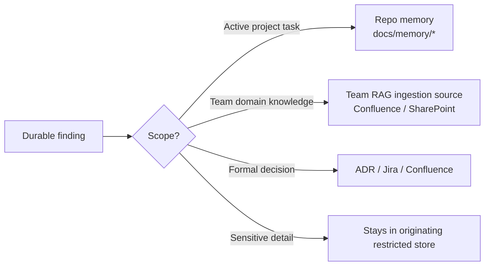

# Write-back Policy — onboarding template

When the assistant produces a durable finding, it doesn't just disappear into a chat transcript. It flows back to the right layer.

This file defines **where** durable findings go for this team, and **who** owns each destination.

> Replace placeholders with the team's real values. Keep this file alongside the other onboarding templates.

---

## Decision tree

---

## Destinations

| Finding type | Destination | Who writes it | Re-index? |
|---|---|---|---|
| Project test/coverage decision | `docs/memory/decision-log.md` in the relevant repo | Engineer / agent (with approval) | No |
| Active blocker | `docs/memory/blocker-index.md` in the relevant repo | Engineer / agent (with approval) | No |
| New stable selector / route | `docs/memory/route-map.md` or `selector-index.md` | Engineer / agent (with approval) | No |
| Team-wide interface clarification | Team Confluence page (Team RAG source) | Team architect / docs lead | Yes — Team RAG re-index |
| Architecture decision (ADR) | ADR repo / Confluence | Owner-group lead | Yes if Team RAG includes ADRs |
| Bug or task | Jira | Engineer / agent (with approval) | Indirect — via Jira connector |
| Sensitive (L3+) finding | Stays in the originating restricted store | Restricted-access role only | Re-index in restricted index only |

---

## Hard rules

1. **Never copy L3+ content into a lower-classification layer.** Link to it instead.
2. **Bump `Last verified: YYYY-MM-DD`** whenever a memory file is updated.
3. **One destination per finding.** If a finding belongs in two places, pick the durable one and link from the other.
4. **Approval before every write.** The agent proposes; a human approves; the audit log records.
5. **Don't write "just-in-case" content.** If nobody will read it, don't write it.

---

## Roles

| Role | Responsibility |
|---|---|
| Engineer / QA | Authors project-memory updates with approval |
| Team architect | Authoritative team-wide updates (Confluence / ADR) |
| Docs lead | Reviews and merges durable Confluence updates |
| Owner group | Sign-off on architecture / interface changes |
| Security owner | Approves anything touching L3+ content |
| Platform team | Operates ingestion pipelines, audit dashboards |

Replace the names with your team's actual people.
